# GripTrack

[](https://github.com/lboehme/griptrack/actions/workflows/ci.yml)


**A training coach for climbers' fingers that lives on your phone.**
GripTrack plans each block-pull (no-hang) session from your tested max,
runs it set by set with plate-accurate loads and a rest timer, and shows
whether the strength actually turns up in your boulder grades. It runs as
a self-contained Android app: no server, no account, works in airplane mode.

<p align="center">
  <a href="docs/marketing/griptrack-promo.mp4">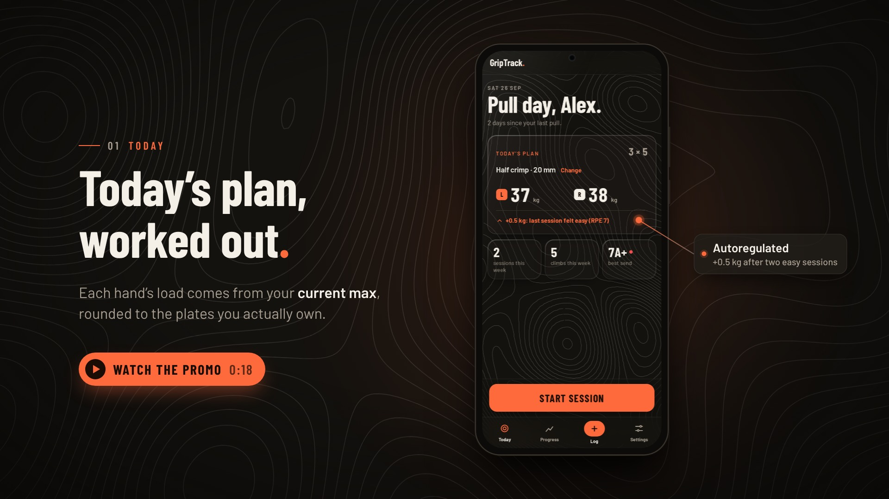</a>
</p>
<p align="center"><sub>▶ <a href="docs/marketing/griptrack-promo.mp4">Watch the 18-second promo</a>
(<a href="docs/marketing/griptrack-promo-portrait.mp4">portrait cut</a>)</sub></p>

<p align="center">
  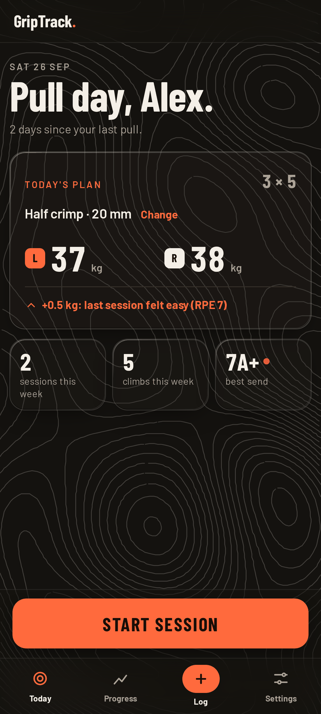
  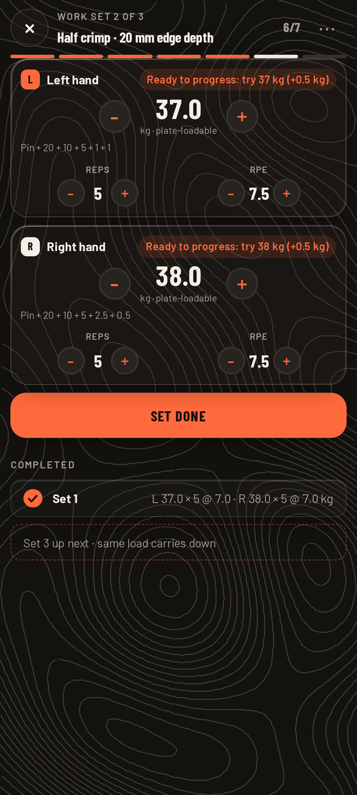
  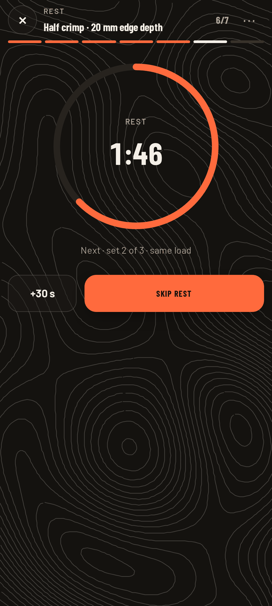
  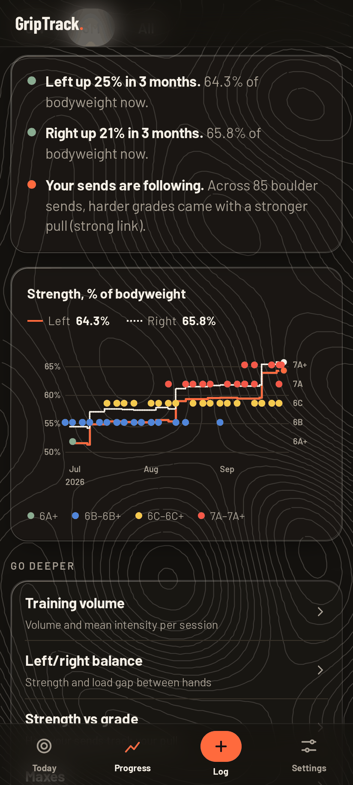
</p>
<p align="center">
  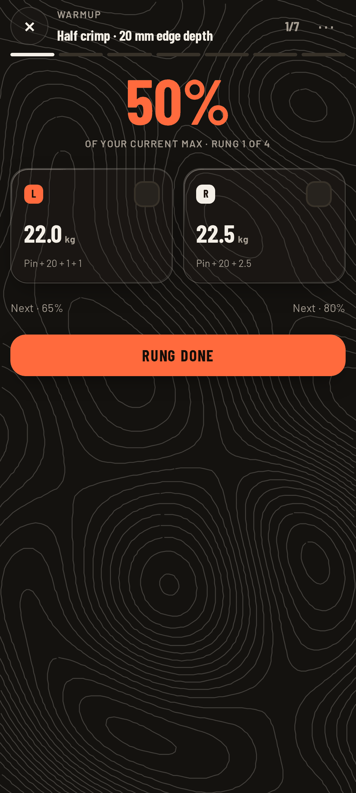
  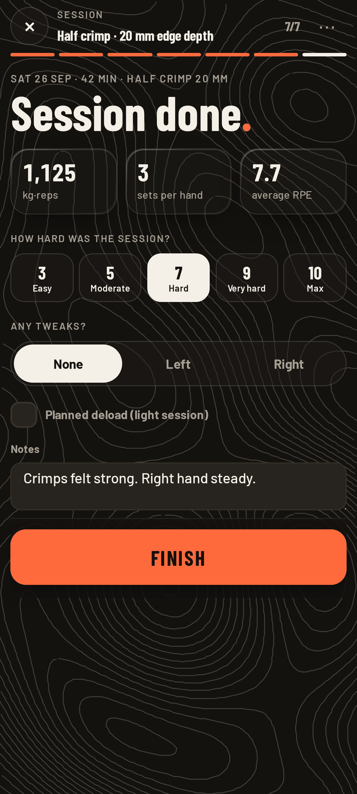
  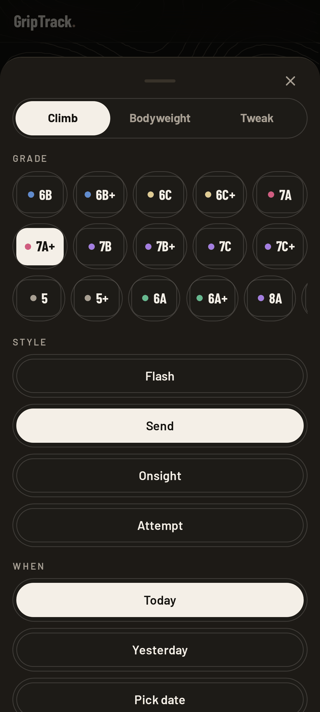
  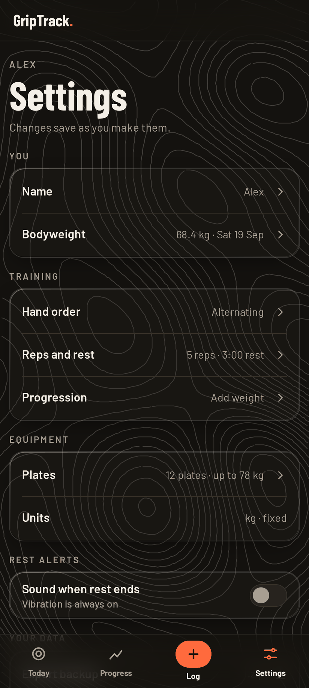
</p>
<p align="center"><sub>The on-device app with a demo account (16 weeks of seeded history).
More screens in <a href="docs/screenshots/app/">docs/screenshots/app/</a>; how they and the video are made:
<a href="docs/marketing/">docs/marketing/</a>.</sub></p>

Finger strength isn't one number. Pulling on a 20&nbsp;mm edge in half
crimp is a different capacity than a 10&nbsp;mm edge in open hand, and
left and right differ too. GripTrack keys everything on the combination
of *hand × grip type × edge size*: max tests, plans, trend charts and
plateau flags all exist per combination, never as a blended "finger
strength" score.

## What it does

The app is built around one loop: **Today** tells you what to do, the
**session** walks you through it, **Progress** tells you whether it worked.

- **Today, as a coach.** The home screen proposes today's session: the
  combination you trained last, sets × reps, each hand's weight and a
  one-line reason ("+0.5 kg: last session felt easy (RPE 7)"). It suggests a
  rest day after two days in a row, offers **Go lighter** after a logged
  tweak, and picks up where you left off with **Resume** if a session is
  still open.
- **A session that runs itself.** One full-screen page steps through the
  warmup rungs (50 / 65 / 80 / 90 % of your current max), then one work set
  at a time: left and right hand cards with steppers and a single **Set
  done**. After each set a rest ring counts down; on the phone the countdown
  also sits on the lock screen and the rest end vibrates (optionally beeps)
  with the screen off. It ends with a summary where you rate the session,
  note tweaks and mark a deload. Every step is saved as you go, and the
  current step is derived from saved state, so a reload or Android killing
  the app resumes on the right step.
- **Plate-aware loading.** Tell it once which plates you own (tap to count
  them). Every suggested weight is a total your pin can actually hold, the
  work-set steppers only walk loadable weights, and each card shows the
  plates to load ("Pin + 20 + 10 + 5 + 2.5"). No more "load 33.7&nbsp;kg".
- **Progression that follows the RPE you log.** Rate sets with RPE and the
  plan adjusts: two easy sessions (every set at RPE ≤ 7, reps hit) and it
  moves you on; a grinder (RPE ≥ 9) or missed reps and it holds or steps
  back. *How* it moves you on is up to you, per combination: add weight,
  add a set, or double progression (build reps, then weight).
- **Guided max testing.** A step-by-step protocol per combination: a fixed
  warmup, then single attempts where an effort rating (effortless → hard)
  sets the next jump. Abandoning mid-test records nothing. When your work
  sets show your max has moved and the last test is 8+ weeks old, the app
  nudges you to retest.
- **Progress that tells a story.** A few plain sentences ("Left up 25 % in 3
  months"), one headline chart of strength as % of bodyweight per hand with
  your boulder sends plotted beside it, and **Go deeper** pages for training
  volume and intensity, left/right balance, strength vs grade, your maxes
  and a week-by-week timeline of everything logged.
- **Warnings worth reading.** Plateau, overtraining and left/right
  asymmetry flags per combination, each a transparent heuristic you can
  recompute from the data under the chart (see below).
- **The rest.** A ＋ Log sheet for boulders (Font and V grades), bodyweight
  and tweaks; kg or lbs, fixed per account; alternating or one-hand-at-a-time
  session order; and a full backup export that restores into a fresh
  install.

## How the analytics work

<p align="center">
  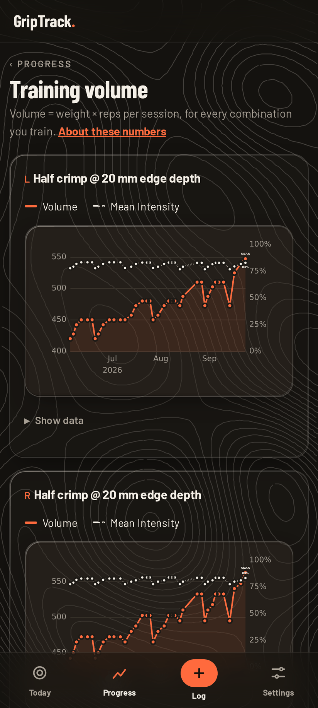
  &nbsp;&nbsp;
  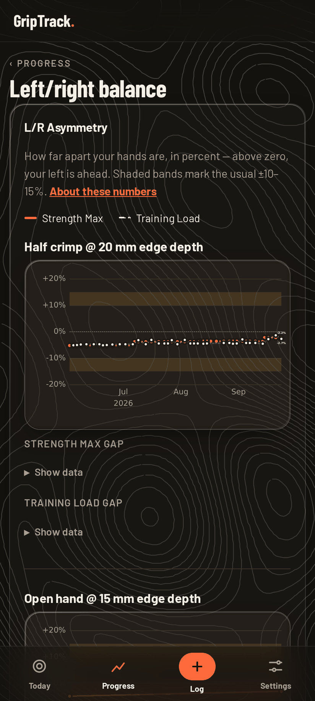
</p>

- **Current max** is not simply your last test. It's the heavier of the
  most recent max test and the heaviest work set logged since: training
  heavier than your last test is itself proof the max moved. A newer test
  always supersedes, even when lower (a deliberate reset after time off or
  injury). Plans, warmup rungs and the strength chart all read current max.
- **Training volume** is the load signal: Σ(weight × reps) per session and
  combination. It rewards adding weight, reps or sets equally, which is the
  right property for low-rep strength work where any of the three is a
  legitimate way to progress. Beside it, **mean intensity** (weight ÷
  current max at the time) shows whether volume came from load or from
  sets. Sessions marked as deloads are excluded.
- **Plateau**: flagged when the last four sessions never beat the best
  volume of the sessions before them. Deliberately dumb and transparent.
- **Overtraining warning**: fires only when the latest session is *both* a
  volume spike (≥ 1.25× the trailing average) *and* followed a
  shorter-than-typical rest gap. Either alone is normal training; together
  they're the pattern that precedes tweaked pulleys.
- **Asymmetry warning**: compares the recent left/right load gap with your
  *own* baseline rather than a textbook "hands should be equal". It fires
  when the gap widens by 5 percentage points over your baseline, or passes
  15 % outright; a narrowing gap never warns.
- **Strength ↔ grade**: Spearman rank correlation between best pull (as %
  of bodyweight, using the bodyweight entry closest before each send) and
  boulder grade, with a floor of 8 data points before any number is shown.
  Spearman rather than Pearson because grades are ordinal and there's no
  reason for the relationship to be linear. Framed against Lattice's
  published finger-strength research as a reference point, not a
  reproduction: their data covers hangboard hangs, not block pulls.

The thresholds are honest heuristics, not validated sports science. Each
is a single named constant in `backend/analytics.py`, flagged for
recalibration once enough real training data exists, and the app's
"About these numbers" page explains them in plain language.

## How it was built

This codebase was written end to end by AI coding agents (Claude Code);
my role was product owner and architect, not typist. The parts of the
process worth stealing:

- **Design before code.** Features start as a PRD that gets interrogated
  question by question until the domain model holds up. The results live in
  [`CONTEXT.md`](CONTEXT.md) (a glossary of canonical terms) and
  [`docs/adr/`](docs/adr/) (15 records of decisions with a real
  trade-off). Slices are then filed as GitHub issues small enough for one
  agent run.
- **Test-first, at one seam.** 700+ tests drive the app through HTTP with a
  fresh in-memory database per test: no mocks, no unit tests coupled to
  internals, so refactoring under them is cheap. A thin Playwright layer
  covers what HTTP can't see (steppers, the rest ring, the native bridge).
- **Separate models write and review.** A cheaper model writes each slice
  test-first in its own worktree; a stronger model hunts for failures in
  the combined diff before merge; a third orchestrates. The reviews caught
  real bugs before they shipped, among them a missing `server_default` that
  would have broken a migration, a double-submit on browser refresh, and a
  route that bypassed session revocation.
- **Gates over discipline.** CI runs the same scripts as local dev: pytest,
  the browser layer, ruff, mypy, pip-audit, a dead-CSS/template check, and
  two migration gates (fresh upgrade from zero, and models-vs-migrations
  drift detection).

Known limits, equally honestly: the analytics thresholds are uncalibrated
placeholders, module internals aren't unit-tested (a deliberate choice),
and SQLite's single-writer model caps the server build at small-group
scale, which is the intended scale.

## Architecture

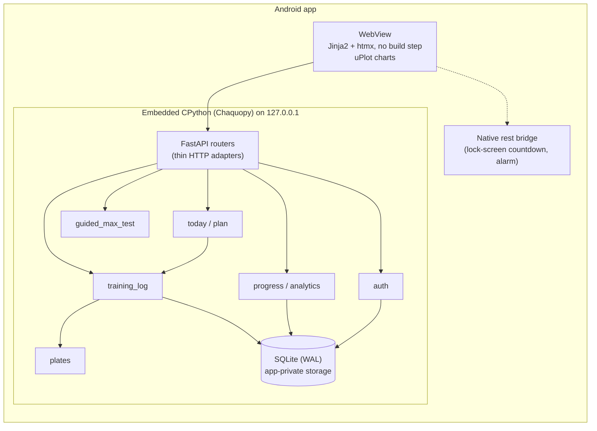

The Android shell ([`android/`](android/)) embeds the *unchanged* FastAPI
backend: on launch it runs the Alembic migrations against an app-private
SQLite file, starts uvicorn on loopback and points a WebView at it. The
same backend also runs as an ordinary web server for development.

Inside, the organizing idea is a few deep modules behind small interfaces,
with routers kept deliberately shallow: parse the request, call one module
function, render a template. Some choices that raise eyebrows, and why:

- **A web app inside an Android app.** One codebase, one test suite, and
  the whole thing was already a mobile-first web app. Chaquopy runs CPython
  on the phone; the only native wheel left to ship is `pydantic-core`
  (password hashing moved to stdlib PBKDF2 for exactly that reason,
  [ADR 0009](docs/adr/0009-pbkdf2-password-hashing.md)).
- **htmx instead of React.** The UI is server-rendered screens and
  autosaving forms; even the training session is a sequence of
  server-derived steps swapped in by htmx
  ([ADR 0014](docs/adr/0014-session-play-as-server-driven-steps.md)). That
  takes a few attributes and zero build step; a SPA would add a toolchain
  and a client state model to keep in sync with the server for no visible
  gain on a phone at the gym.
- **Charts drawn client-side with uPlot, vendored as a static file.** The
  server ships each series into the page as JSON and small vanilla-JS
  modules draw it: no build step, no CDN, and it let the app drop
  matplotlib and pandas.
- **SQLite, WAL mode, one file.** One user per phone; a database server
  would be pure overhead.
- **Weights stored in the user's own unit (kg *or* lbs), not normalized.**
  Plates are physical objects denominated in one unit; canonical-kg storage
  would hand lbs users suggestions their plates can't load.
  ([ADR 0003](docs/adr/0003-native-unit-storage.md))
- **A real plate-inventory model.** Loading suggestions run a small
  subset-sum over the plates you actually own rather than rounding to
  2.5&nbsp;kg. ([ADR 0002](docs/adr/0002-real-plate-inventory-for-rounding.md))
- **The rest timer counts down to a stored end time**, never a client
  counter, so it survives the app being killed; the native bridge schedules
  an exact alarm for the same instant
  ([ADR 0015](docs/adr/0015-native-rest-bridge.md)).

Security follows from the scope but isn't skipped. On the phone the app is
single-user: the shell signs in with a per-install device token, and there
is no password to leak ([ADR 0013](docs/adr/0013-single-user-install-with-device-sign-in.md)).
The server build keeps invite-only registration, PBKDF2 password hashing,
per-IP rate limiting with timing-equalized login, and session revocation on
password reset. Both get SameSite + Origin-check CSRF defense, a strict
security-header set and upper bounds on every numeric input.

## Running it

**Locally (development).** Python 3.12:

```bash
pip install -r requirements.txt
alembic upgrade head          # creates and seeds griptrack.db
uvicorn backend.main:app --reload
```

Open http://127.0.0.1:8000/register. The first account needs no invite
and becomes the admin, who can generate invite codes from Settings → Admin.
To try it on your phone's browser, run with `--host 0.0.0.0` and use your
machine's LAN address.

**Tests and gates:**

```bash
pip install -r requirements-dev.txt
scripts/test               # pytest, HTTP-seam suite
scripts/test-browser       # Playwright layer (needs Chromium)
scripts/lint               # ruff + mypy + pip-audit + dead-CSS check
scripts/check-migrations   # migration gates
```

**The Android app.** With JDK 17 and the Android SDK installed,
`scripts/generate-apk` builds the APK (`--install` sideloads it onto a
connected device via adb). Details, prerequisites and the on-device smoke
checklist are in [`android/README.md`](android/README.md).

**Screenshots and the promo video** are generated from the real app by
the scripts in [`docs/marketing/tooling/`](docs/marketing/tooling/); see
[`docs/marketing/README.md`](docs/marketing/README.md).

## Status

In daily use and still developed; current work is tracked in the issues
and the open roadmap lives in [`CLAUDE.md`](CLAUDE.md). What's left on the
list: a refactor of the progression code into its own module (#135) and,
once enough pain-report, session-load and deload data has accumulated, a
per-grip injury-risk guardian (#28) that the current overtraining warning
is a crude prototype of.

---

Built by Lukas, a physicist who climbs,
which is why the statistics above get more care than the CSS.
