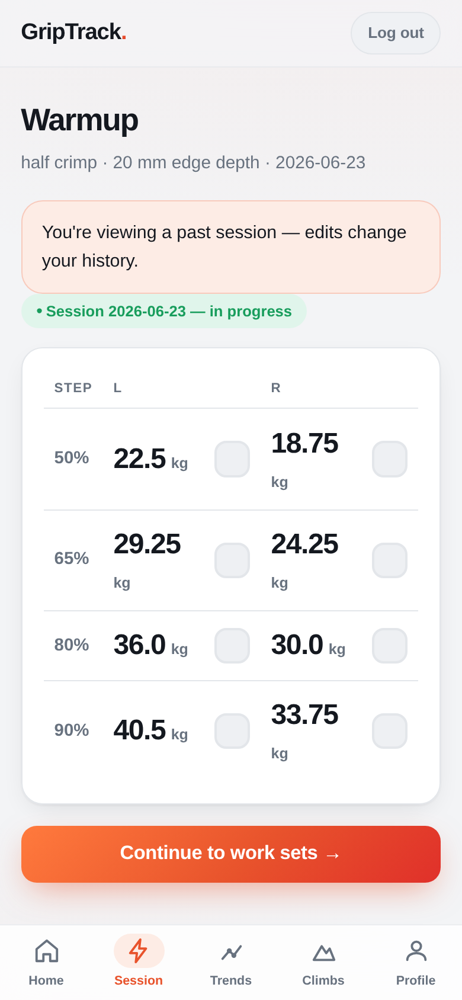
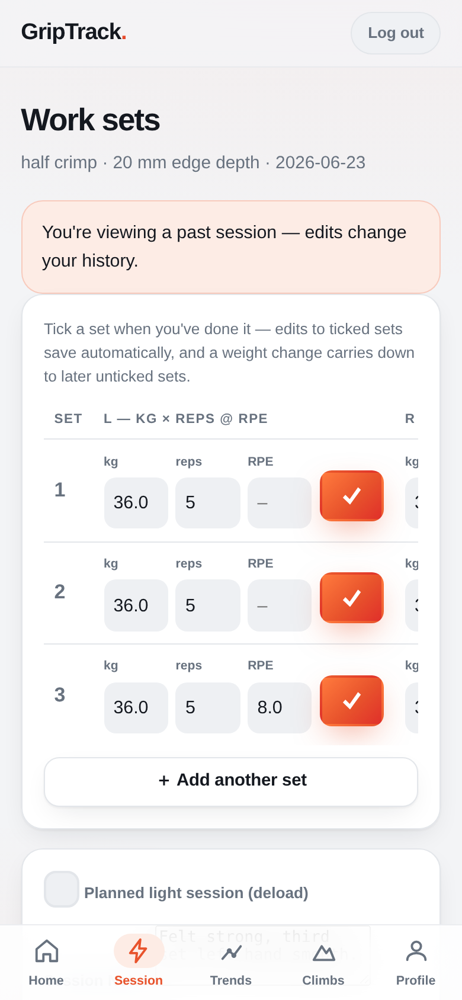
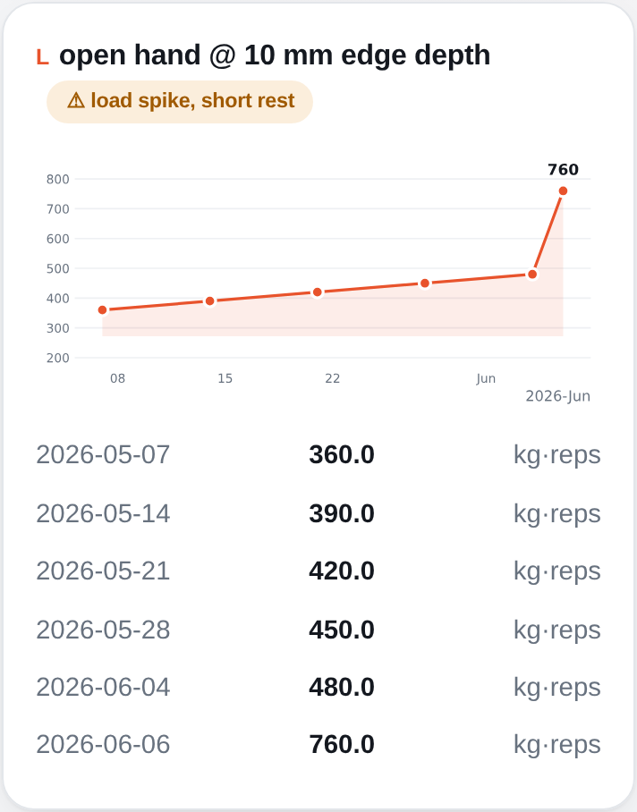
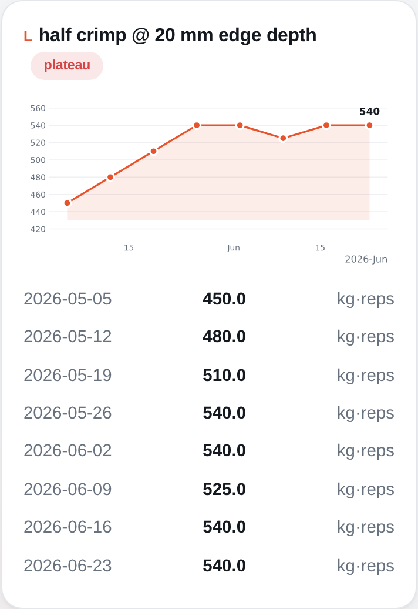
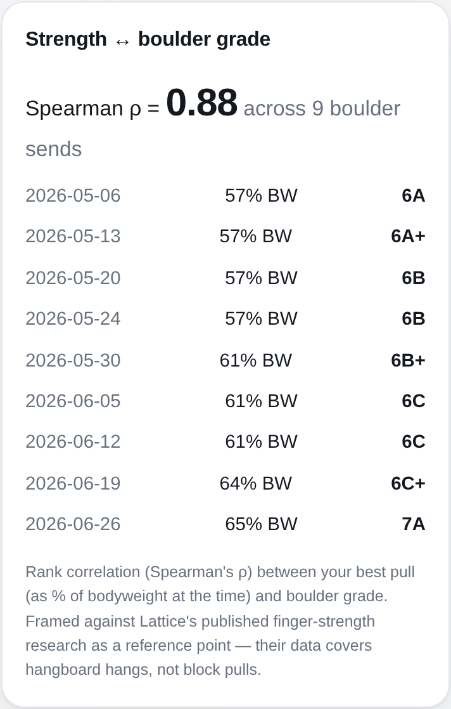
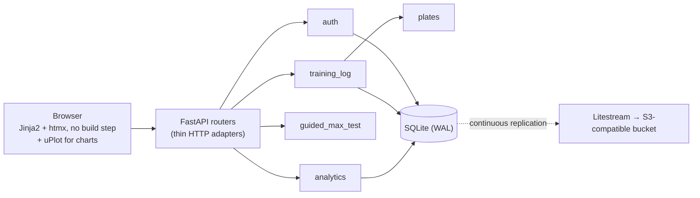

# GripTrack

[](https://github.com/lboehme/griptrack/actions/workflows/ci.yml)


A mobile-first PWA for data-driven finger-strength training in climbing.
It tracks block-pull (no-hang) training per hand, grip and edge size,
computes plate-accurate loading suggestions from your tested max, and
tells you whether the training actually shows up in your climbing.

<p align="center">
  
  &nbsp;
  
  &nbsp;
  
</p>

Finger strength isn't one number. Pulling on a 20&nbsp;mm edge in half
crimp is a different capacity than a 10&nbsp;mm edge in open hand, and
left and right differ too. GripTrack keys everything on the combination
of *hand × grip type × edge size* — max tests, session suggestions,
trend charts and plateau flags all exist per combination, never as a
blended "finger strength" score.

## What it does

- **Guided max testing** — a step-by-step protocol per combination:
  fixed warmup, then single attempts where an effort rating
  (effortless → hard) drives the next weight jump. Abandoning mid-test
  records nothing; only the final "that's enough" writes a result.
- **Session logging without a submit button** — a warmup checklist and a
  work-set table, both saving on every interaction. Getting interrupted
  at the gym loses nothing.
- **Plate-aware loading** — you tell it which plates you own once; every
  suggested weight is rounded down to a total your pin can actually
  hold. No more "load 33.7&nbsp;kg".
- **Plateau detection and overtraining warnings** per combination (see
  methodology below).
- **Strength ↔ grade correlation** — does the finger strength show up on
  the wall? Best pull as % of bodyweight, rank-correlated against your
  boulder sends.
- **The usual rest**: bodyweight and climb logging (Font and V grades),
  session notes, deload marking, pain reports per hand, full history,
  CSV export of everything, and PWA install with an offline fallback.

GripTrack runs as a personal instrument for a handful of climbers, so
registration is invite-only rather than open signup. If you'd like to
click around a live instance, a demo account with sample data is
available on request — or run it locally in three commands (see below).

## How the analytics work

The load signal is **training volume**: Σ(weight × reps) per session and
combination. It rewards adding weight, reps or sets equally, which is
the right property for low-rep strength work where any of the three is a
legitimate way to progress. Sessions marked as deloads are excluded.

<p align="center">
  
  &nbsp;&nbsp;
  
</p>

- **Current max** is not simply your last test. It's the heavier of the
  most recent max test and the heaviest single work set logged since —
  training heavier than your last test is itself proof the max moved,
  no retest needed. A newer test always supersedes, even when lower
  (deliberate reset after time off or injury).
- **Plateau**: flagged when the last four sessions never exceeded the
  best volume of the sessions before them. Deliberately dumb and
  transparent — you can recompute it from the table under the chart.
- **Overtraining warning**: fires only when the latest session is *both*
  a volume spike (≥ 1.25× the trailing average) *and* came after a
  shorter-than-typical rest gap. Either signal alone is normal training;
  together they're the pattern that precedes tweaked pulleys.
- **Strength ↔ grade**: Spearman rank correlation between best pull (as
  % of bodyweight at the time, using the bodyweight entry closest before
  each send) and boulder grade, with a floor of 8 data points before any
  number is shown. Spearman rather than Pearson because grades are
  ordinal and the relationship has no reason to be linear. Framed
  against Lattice's published finger-strength research as a reference
  point, not a reproduction — their data covers hangboard hangs, not
  block pulls.

The thresholds are honest heuristics, not validated sports science. They
are single constants in `backend/analytics.py`, flagged for
recalibration once enough real training data exists.

## How it was built

This codebase was written end to end by AI coding agents (Claude Code);
my role was product owner and architect, not typist. The parts of the
process worth stealing:

- **Design before code.** Features start as a PRD that gets
  interrogated question by question until the domain model holds up —
  the results live in [`CONTEXT.md`](CONTEXT.md) (a glossary of
  canonical terms) and [`docs/adr/`](docs/adr/) (records of every
  decision with a real trade-off). Slices are then filed as GitHub
  issues small enough for one agent run.
- **Test-first, at one seam.** All 173 tests drive the app through HTTP
  with a fresh in-memory database per test — no mocks, no unit tests
  coupled to internals. Refactoring under the tests is cheap because
  they only pin observable behavior.
- **Separate models write and review.** A cheaper model writes each
  slice test-first; a stronger model reviews the diff before merge; a
  third orchestrates. The reviews caught real bugs before production —
  among them a missing `server_default` that would have broken the
  deploy migration, a double-submit on browser refresh, and a route
  that bypassed session revocation.
- **Gates over discipline.** CI runs the same scripts as local dev:
  pytest, ruff, mypy, pip-audit, plus two migration gates (fresh
  upgrade from zero, and models-vs-migrations drift detection). The
  service worker's cache version is a content hash so nobody has to
  remember to bump it.

Known limits, equally honestly: the analytics thresholds are
uncalibrated placeholders, tests cover the HTTP seam only (module
internals are not separately unit-tested — a deliberate choice), and
SQLite's single-writer model caps this at small-group scale, which is
the intended scale.

## Architecture



The organizing idea is a few deep modules behind small interfaces, with
routers kept deliberately shallow: parse the request, call one module
function, render a template. Some choices that raise eyebrows, and why:

- **htmx instead of React.** The UI is forms and tables with per-field
  autosave. htmx does that in a few attributes with zero build step; a
  SPA would add a toolchain and a client state model to keep in sync
  with the server for no visible gain on a phone at the gym.
- **Client-side charts with uPlot, vendored as a plain static file.**
  The server ships the ordered `(date, volume)` series into the
  dashboard DOM as JSON, and a small vanilla-JS module draws one chart
  per (hand, grip_type, edge_mm) combo — no build step, no CDN, and it
  shrank the dependency footprint by dropping matplotlib/pandas (#87–#89).
- **SQLite, WAL mode, one file.** A handful of users, one process, one
  volume — a database server would be operational overhead with no
  benefit. Continuous off-box backup comes from Litestream instead.
- **Weights stored in the user's own unit (kg *or* lbs), not normalized.**
  Plates are physical objects denominated in one unit; canonical-kg
  storage would hand lbs users suggestions their plates can't load.
  Fixed at signup. ([ADR 0003](docs/adr/0003-native-unit-storage.md))
- **A real plate-inventory model.** Loading suggestions run a small
  subset-sum over the plates you actually own rather than rounding to
  2.5&nbsp;kg. ([ADR 0002](docs/adr/0002-real-plate-inventory-for-rounding.md))

Security follows from the personal-instrument scope but isn't skipped:
bcrypt, invite-only registration, per-IP rate limiting with
timing-equalized login, session revocation on password reset,
SameSite + Origin-check CSRF defense, a strict security-header set, and
upper bounds on every numeric input.

## Running it

Python 3.12:

```bash
pip install -r requirements.txt
alembic upgrade head          # creates and seeds griptrack.db
uvicorn backend.main:app --reload
```

Open http://127.0.0.1:8000/register — the first account needs no invite
and becomes the admin, who can then generate invite codes from the
profile page. To try it on your phone, run with `--host 0.0.0.0` and use
your machine's LAN address.

Tests and gates:

```bash
pip install -r requirements-dev.txt
scripts/test               # pytest, HTTP-seam suite
scripts/lint               # ruff + mypy + pip-audit
scripts/check-migrations   # migration gates
```

For real deployment (Docker, env vars, HTTPS, backups) see
[`docs/deployment.md`](docs/deployment.md) — the short version is one
container, one persistent volume for the SQLite file, and five env vars
if you want Litestream replication.

## Status

Actively used and developed. Current work is tracked in the issues;
the open roadmap lives in [`CLAUDE.md`](CLAUDE.md). Bigger items on the
list: left/right asymmetry analytics, and — once enough pain-report and
deload data has accumulated — a per-grip injury-risk guardian that the
current overtraining warning is a crude prototype of.

---

Built by Lukas, a physicist who climbs —
which is why the statistics above get more care than the CSS.
