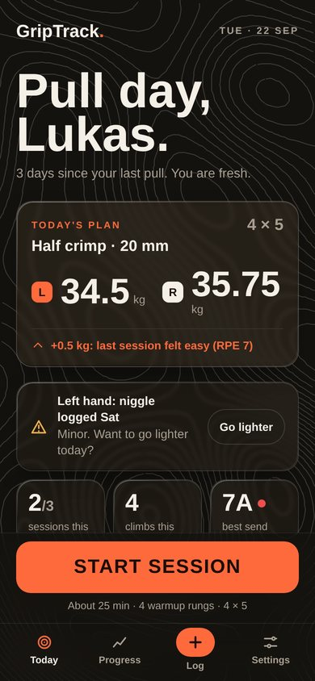
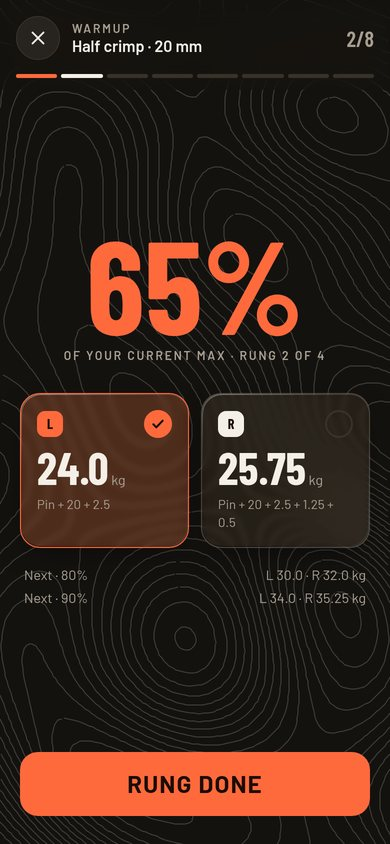
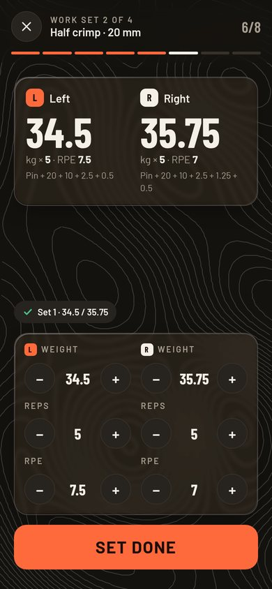
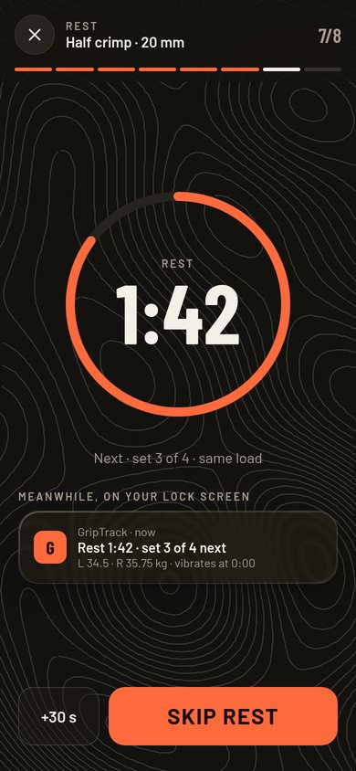
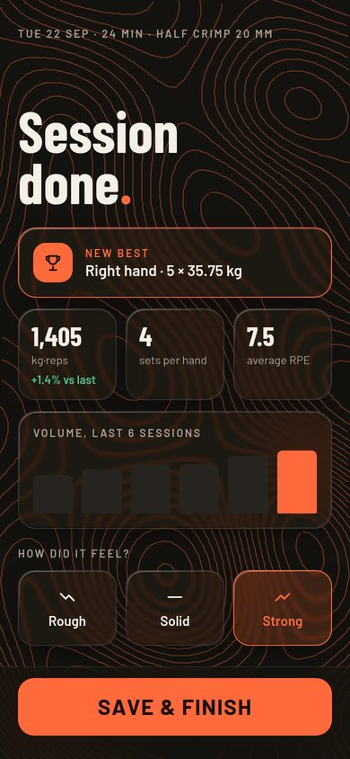
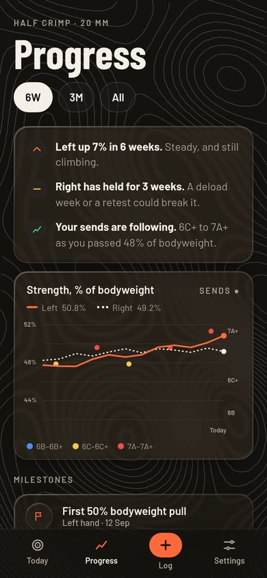
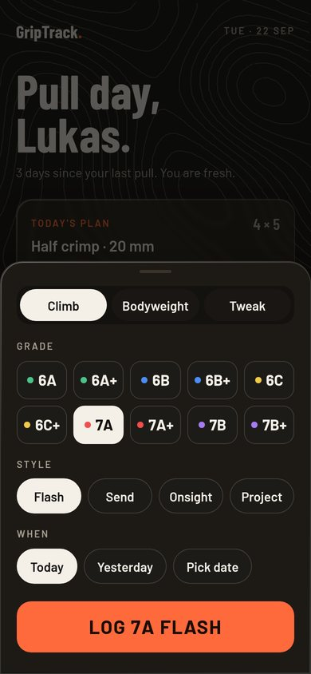
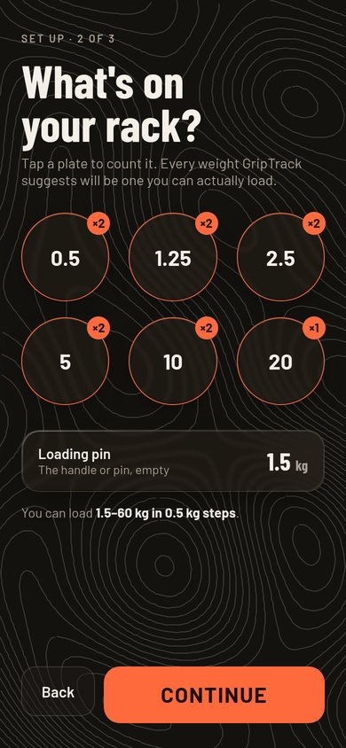

# UI review: GripTrack as an Android app (2026-09-22)

**Scope:** every screen of the web UI (`backend/templates/`, `backend/static/app.css`)
and the Android shell (`android/app/src/main/`). The review asks what changes now
that GripTrack runs as an on-device app in a WebView on one phone, instead of as a
website opened in a browser.

**Method:** I booted the real app (`tests/e2e/conftest.py`'s `live_server`) and
seeded it with ~10 weeks of data: 18 sessions, two max tests, 11 climbs and a
bodyweight entry. I then drove it with Playwright using a Pixel-7-class Android
WebView user agent, touch and `isMobile`, in light and dark mode, at 412 px and
360 px wide, and at 130% font scale. Screenshots are in
`docs/screenshots/ui-review-2026-09/`. Android-shell findings come from reading
the source. They were **not** checked on hardware. The last device smoke test
ran on a Galaxy S22 Ultra with Android 16 (`docs/android-smoke-checklist-2026-08-18.md`).
Findings marked *verify on device* need a look on that phone.

---

## Summary

The Focus session screens are the strongest part of the app. They have large
tabular numerals, 44 px+ targets, one clear primary action, and a dark mode that
looks deliberate rather than inverted. The rest of the app still looks and
behaves like a **website that was put in a frame**:

- It has a login screen and a "Log out" button on every page, and the login expires every 14 days.
- It has admin/invite concepts and a Home screen that duplicates the tab bar.
- It shows raw ISO dates and raw enum values (`left`, `half crimp`, `redpoint`).
- The Android shell doesn't yet handle the things an app gets judged on: system bar insets on Android 15+, the keyboard, Back, dark-mode or config changes, rest-timer alerts while the screen is off, and resuming mid-session after the OS kills the app.

There are also **seven small, verified rendering and copy bugs** (§1). Most are
one-line fixes.

The report has two parts. **Direction** (next section) is the big-picture
redesign: what GripTrack could become as an app. **§1–§6** are concrete
findings on the current UI. Many of them are absorbed by the redesign, but they
are worth fixing now because the redesign is a longer road.

Priority key: **P1** = hurts the core between-hangs flow or is plainly broken ·
**P2** = noticeable friction or looks unfinished · **P3** = polish.

---

## Direction: the bigger redesign

§1–§6 fix what's there. This part is about what GripTrack could become. These
are directions to grill and prototype, not tickets.

### D0. The core shift: organise around the training loop, not the database

Today the app's structure copies its data model. There's a page per table:
Sessions, Max tests, Climbs, Trends, Profile, Plates. You think in three
questions:

1. **What do I do today?**
2. **Do it.** Warm up, pull, rest, repeat.
3. **Am I getting stronger, and does it show in my climbing?**

Rebuild the navigation around those:

| Tab | What it is | What it replaces |
|---|---|---|
| **Today** | A small coach: today's plan, recovery status, one big Start button | Home's menu of tiles |
| **Progress** | The story of your strength and climbing | Trends, History and Max tests merged |
| **Log** (or a floating ＋) | Quick capture: a climb, bodyweight, a pain note | The Climbs page, the Profile bodyweight card |
| **Settings** | Rarely touched: units, plates, protocol, data | Profile's pile of forms |

Max tests stop being their own section and become a kind of session ("Test
day") inside the same flow. They're rare, so they don't deserve a place in the
main navigation.

### D1. Today as a coach

The app already knows almost everything needed to tell you what to do: last
session, `CurrentMax`, loadable plates, protocol, autoregulation suggestion, days
since you last trained, recent pain reports. Home should say it outright:

> **Half crimp · 20 mm**, last trained 3 days ago
> Today: 4 × 5 @ **34 kg L / 35.25 kg R** (+1.25 kg, last session felt easy)
> [ **Start** ]
> ⚠ You logged a left-hand tweak on Tuesday. Go light?

That's one screen, one decision and one tap. The Wave 4 nudges (retest due,
plateau, deload) all belong here instead of scattered banners.

### D2. The session as one continuous "player"

Warmup and work sets are currently separate pages with navigation buttons
between them. Strong workout apps (Strong, Hevy, Garmin workouts) treat a
session as **one screen that moves forward**: warmup rung → rung → work set →
rest → set → … → **summary**. Three things follow:

- **No navigation during a session.** No tab bar, no header, just the current
  step, what comes next, and a way out.
- **The session keeps going when you leave the app.** An ongoing Android
  notification shows "Rest 1:42 · Set 3 of 4 next · 34 kg". It's visible on the
  lock screen and vibrates when rest is over. This does more than anything else
  to make GripTrack feel like a real app (it builds on the native bridge in §2.2).
- **A summary screen at the end.** This is the payoff the app is missing: volume
  vs last time, a PR badge if there is one, and a one-tap "how did it feel"
  (😣 😐 💪) plus an optional note. It replaces the "How did it feel?" section
  tucked under the sets, which you'd mostly never open.

### D3. Design for the gym, not the desk

The real conditions are chalky fingers, pumped forearms, the phone on a bench at
arm's length, and glances between hangs:

- **Controls at the bottom, readouts at the top.** Everything you tap sits in
  the thumb zone; the top half is for big numbers you read. Today it's the other
  way round: titles at the top, actions you scroll down to reach.
- **Readable from a metre away.** Bigger weight numbers, fewer words, strong
  contrast. Think of a gym clock, not a form.
- **Hold-to-repeat and swipe.** Swipe a completed set to edit it, long-press a
  stepper to run the value up.
- **Dark by default during a session**, whatever the system setting. It's
  calmer, uses less battery, and reads better under gym lighting.

### D4. A visual identity of its own

The current look is competent but generic: every element is a white rounded
card with a shadow, and every button has the orange gradient. Almost everything
sits in a box, so nothing stands out.

- **Fewer containers.** Separate things with type size and spacing, not cards.
  Keep cards for things you can tap.
- **Use the gradient once.** Reserve it for the single primary action on a
  screen (Start, Set done). Everything else goes flat. Profile currently has
  eight gradient buttons.
- **A display typeface for numbers.** A condensed or monospaced numeric face,
  bundled locally like uPlot, for weights and grades. Numbers are the hero of
  this app, and a distinct numeral style would do most of the branding work.
- **Borrow from climbing culture.** Gyms colour-code grades. A grade colour
  scale (6A green → 7A red → 8A black) used in climb chips, the correlation
  chart and history would make the climbing side feel native instead of like a
  text list. A topo-line motif carries the climbing feel (the prototype
  settled on one contour map behind every screen: see Visual language, V4).
- **Material 3 structure, your own skin.** It's an Android app now, so use the
  conventions people know: bottom sheets, a top app bar, predictive back,
  snackbars. Keep the orange and dark palette so it's still yours.

### D5. Progress tells a story before it shows statistics

Trends currently reads like an analyst's notebook: Spearman's ρ, signed gaps,
"TrainingVolume", raw data tables. Lead with the story and put the maths behind
it, in three layers:

1. **Headline sentences.** "Left half crimp up 8% in 6 weeks. Right has been
   flat for 3 weeks. Asymmetry is 5%, inside the normal range."
2. **One main chart.** Strength as % of bodyweight over time, both hands, with
   your climbing grades plotted on the same timeline. That single view is the
   point of the app: finger strength and climbing moving together.
3. **Details on tap.** Volume, asymmetry, correlation and the raw data live one
   level down.

Also add **milestones and personal records**: "first time pulling 50% of
bodyweight on a 20 mm edge", "10 sessions this month". They're cheap to build
and they're what brings people back.

### D6. Make input nearly free

Any number the app can predict should be filled in already, so that a normal set
is **one tap**. Small entries (log a climb, log bodyweight, edit a set) should
be **bottom sheets** over the current screen, not separate pages with forms. A
climb log becomes: tap ＋ → grade chips around your usual level → style chips →
done, about three taps. Bodyweight becomes a weekly prompt on Today rather than
a form in Profile.

### D7. One voice

The tone shifts between playful ("Hey lukas 👊", "Ready to pull?"),
engineering-speak ("TrainingVolume", "Spearman's ρ") and even internal
references: the Profile page says "(ADR-0012)" in its copy. Pick one voice, most
likely a **plain-spoken coach**. It's short, confident and about climbing, and
the technical terms go into an "About these numbers" sheet.

### D8. The first run as a story

Registration and invites are server-era leftovers (§4). On a phone the first run
should be three steps: **Units & hands → Your plates (tap the ones you own) →
Your first max test (guided)**. It ends on Today with a real plan. Empty states
along the way should teach ("Log 8 sends and I'll show how your strength tracks
your grade") instead of being blank.

### How to approach it

These are bigger than tickets. They're a redesign, and it deserves the same
process that produced the Focus screens:

1. **A short grill on the navigation (D0) and the Today coach (D1)**, since
   everything else hangs off those.
2. **Mockups before code.** A clickable prototype of Today → session player →
   summary → Progress, in the current palette, to try on the phone before any
   template changes.
3. **Build it in slices:** session player plus lock-screen notification first
   (the biggest win at the board), then Today, then Progress, then the visual
   refresh across the app.

---

## Visual language (from the prototype)

The Direction above was prototyped as a clickable phone mockup on a claude.ai
design canvas: https://claude.ai/artifact/KKCFk5Nkpx7zzuYvWUJDs7 (private to the
owner). This section records its look precisely enough to rebuild it in
`backend/static/app.css` and the Jinja templates without reopening the
prototype. The prototype's markup format doesn't carry over, but its CSS
does: every value below was copied from the final, screenshot-checked version.

| Today | Warmup | Work set | Rest |
|---|---|---|---|
|  |  |  |  |
| **Summary** | **Progress** | **Log sheet** | **First run: plates** |
|  |  |  |  |

### V1. Principles

1. **One landscape.** A single topographic contour map sits behind every
   screen and stays still while content scrolls over it. Nothing else draws
   its own contour lines.
2. **Glass over the map.** Surfaces are translucent frosted glass, so the map
   shows through. The more important the content, the stronger the frosting
   (V6).
3. **Numbers are the hero.** Weights, percentages, times and grades use a
   condensed display face at large sizes. Everything else is quiet.
4. **Orange means "do this".** The accent fills the one primary action per
   screen, the left-hand badge, progress and live state. It is not used for
   decoration.
5. **Gym mode.** A warm charcoal dark theme, readable at arm's length. Light
   mode was not designed (see V11).

### V2. Colour tokens

| Token | Value | Use |
|---|---|---|
| `--bg` | `#14120F` | App ground (warm charcoal) |
| `--s1` | `#1D1A16` | Solid surface (bottom sheet) |
| `--s2` | `#27231E` | Raised fill (round steppers, empty ring track) |
| `--line` | `#383229` | Hairlines, progress-segment track |
| `--tx` | `#F4EFE7` | Text ("chalk white"); also the right-hand badge and selected chips |
| `--mu` | `#A89F92` | Secondary text, overline labels, axis labels |
| `--acc` | `#FF6A3D` | Accent: primary button, left-hand badge, live state |
| on-accent | `#1B0D06` | Text and icons on `--acc` (≈ 6.7:1) |
| `--ok` | `#4CC38A` | Positive deltas, "logged" states |
| `--warn` | `#F2B24C` | Tweak/pain warnings, plateau |
| glass rim | `rgba(244,239,231,.13–.20)` | Borders on glass |
| topo stroke | `rgba(244,239,231,var(--topo))`, `--topo: .2` | The map |

**Hands:** Left = orange badge (`--acc`), Right = chalk badge (`--tx`), both
with dark text. This also fixes the old light-salmon right badge's contrast
failure (§6). In charts, Left is a solid orange 2.5 px line and Right a chalk
dotted line (`stroke-dasharray: 1 5`), so they differ by more than colour.

**Grade colours** (gym-circuit style, used on grade chips, send dots and the
"best send" dot):

| Grades | Colour |
|---|---|
| 6A, 6A+ | `#4CC38A` green |
| 6B, 6B+ | `#4C8DF6` blue |
| 6C, 6C+ | `#F2C94C` yellow |
| 7A, 7A+ | `#EF4E4E` red |
| 7B and up | `#A77BF3` purple |

### V3. Typography

Two families, both SIL Open Font License: **Barlow Condensed** (500/600/700)
for display and numbers, **Barlow** (400/500/600/700) for text. The prototype
loaded them from Google Fonts. The app is offline, so **vendor the `.woff2`
files under `backend/static/fonts/`** with `@font-face`, like uPlot is vendored.

| Role | Face | Size / weight | Example |
|---|---|---|---|
| Screen headline | Condensed 700, line-height .9 | 52–64 px | "Pull day, Lukas." |
| Hero number | Condensed 700, line-height .85–.9 | 60 px (set weights), 92 px (rest timer), 132 px (warmup %) | 34.5 · 1:42 · 65% |
| Card number | Condensed 700 | 30–46 px | 1,405 · 7A |
| Stepper value | Condensed 700 | 22 px | 5 |
| Primary button | Condensed 700, uppercase, `letter-spacing: .05em` | 24 px | START SESSION |
| Overline label | Barlow 600, uppercase, `letter-spacing: .16em`, `--mu` | 12 px | TODAY'S PLAN |
| Body | Barlow 400–500 | 15–16 px, line-height 1.4 | |
| Emphasis in body | Barlow 600 | 16–19 px | "Half crimp · 20 mm" |

Use `font-variant-numeric: tabular-nums` wherever numbers update in place
(steppers, timer) so they don't jitter.

### V4. The topo map

- **Asset:** `docs/design/topo-map.svg`, a 390 × 900 contour map (~55 KB, one
  `<path>`, `stroke="currentColor"`). `docs/design/topo_generator.py`
  regenerates it identically (seed 21) or makes new landscapes (`--seed N`).
  It needs numpy and matplotlib, so it's a one-off design tool, not part of
  the app. Copy the SVG into `backend/static/` when building.
- **One fixed layer per screen:** the map is the first child of the screen
  container, absolutely positioned to fill it, and **outside** the scrolling
  element. Content scrolls over it, which is what makes the glass feel alive.
  In the real multi-page app, put it once in `base.html` as a
  `position: fixed` layer behind `<main>`, so the landscape doesn't jump
  between pages.
  ```css
  .topo-map { position: fixed; inset: 0; width: 100%; height: 100%;
              color: rgba(244,239,231,.2); pointer-events: none; z-index: 0; }
  /* <svg class="topo-map" viewBox="0 0 390 900"
          preserveAspectRatio="xMidYMin slice" aria-hidden="true"> */
  ```
- **Strength:** stroke opacity `.2` at 1 px. The prototype exposed this as a
  tweak between 0 and .4. Much above .25 starts to fight the text.
- **Celebration variant:** the session summary shows the same map in the
  accent colour (`color: var(--acc)` with the layer at about 45% opacity).
  It's the one place the map changes colour.
- **Don't:** give individual cards or headers their own contour art. The
  first prototype did, and the patterns didn't line up (owner feedback).

### V5. Chrome

- **Bars** (session top bar, Today's Start bar, bottom nav) are frosted, not
  solid, so the map continues under them:
  `background: rgba(20,18,15,.55); backdrop-filter: blur(14px) saturate(150%);`
  with a top hairline of `rgba(244,239,231,.08)`.
- **Bottom nav:** 72 px tall. Four slots: Today, Progress, a centre **Log**
  (a 48 × 36 orange pill with a ＋), Settings. Icons are 22 px strokes at
  2 px. The active tab has chalk text and an orange icon.
- **Session top bar:** a ✕ round button (pause), an overline title ("WORK SET
  2 OF 4") over the combo, a step counter ("6/8") on the right, and a row of 8
  segments below (`4 px`, done = `--acc`, current = `--tx`, rest = `--line`).
  No tab bar during a session.

### V6. Glass materials

Two levels. Both are a translucent fill plus a light `backdrop-filter`, a
1 px rim, and a specular edge.

```css
/* Level 1: default glass (stat tiles, list cards, feel buttons, plates) */
.glass {
  background: rgba(40,35,30,.22);
  border: 1px solid rgba(244,239,231,.14);
  backdrop-filter: blur(2.5px) saturate(170%) brightness(1.18);
  box-shadow: inset 0 1px 0 rgba(255,255,255,.12),
              inset 0 -1px 0 rgba(0,0,0,.35),
              0 10px 30px -12px rgba(0,0,0,.6);
}
/* Level 2: strong glass for content that must read first:
   the Progress chart and story, Today's plan, session weights, warmup tiles */
.glass.strong {
  background: rgba(44,38,32,.24);
  border-color: rgba(244,239,231,.2);
  backdrop-filter: blur(3.5px) saturate(180%) brightness(1.6);
}
/* Specular rim: a masked 1px gradient border, brighter at the top-left */
.glass::before {
  content: ""; position: absolute; inset: 0; border-radius: inherit; padding: 1px;
  background: linear-gradient(150deg, rgba(255,255,255,.34), transparent 32%,
                              transparent 70%, rgba(255,255,255,.12));
  -webkit-mask: linear-gradient(#000 0 0) content-box, linear-gradient(#000 0 0);
  -webkit-mask-composite: xor; mask-composite: exclude; pointer-events: none;
}
/* Selected glass tile (ticked warmup hand, chosen "feel") */
.glass.on { border-color: var(--acc); background: rgba(255,106,61,.16); } /* .20 on .strong */
```

Lessons from getting this right (each was a visible failure in an earlier
version):

- **Heavy blur doesn't work over thin lines.** A 1 px line at 20% opacity
  blurred by more than ~4 px turns into a flat colour, and the "stronger"
  cards looked like black boxes. "Stronger" glass therefore means a bit more
  blur plus **more brightness**, not a big blur radius.
- **No SVG displacement ("liquid refraction") filter.**
  `backdrop-filter: url(#filter)` left a visible offset rectangle inside
  every card. The live feel comes from the map staying still while glass
  scrolls over it.
- **Sheets and overlays are solid** (`#1D1A16`). A translucent bottom sheet
  let the orange Start button and big numbers behind it smear through.
- Radii: cards 20 px, tiles 20 px, feel buttons 18 px, primary button 18 px,
  secondary 16 px, chips fully rounded, sheet 28 px top corners.

### V7. Components

| Component | Spec |
|---|---|
| **Primary button** | 64 px tall, full width, radius 18, `--acc` fill, on-accent text, Condensed 700 24 px uppercase. One per screen, pinned in the bottom action area. Press: `scale(.97)`. |
| **Secondary button** | 56 px (64 next to a primary), radius 16, `rgba(32,28,24,.45)` fill, 1.5 px rim `rgba(244,239,231,.16)`, Barlow 600 17 px. |
| **Chip** | 44 px tall, fully rounded, same fill and rim as secondary. Selected: chalk fill, `--bg` text. Used for segmented choices (range 6W/3M/All, style, hand, units). |
| **Grade chip** | 48 px, radius 14, Condensed 700 19 px, with an 8 px grade-colour dot before the label. 5-column grid. |
| **Round stepper** | 44 × 44 circle, `--s2` fill, `--line` rim, "−" / "+" at 22 px. Always paired around a Condensed value. |
| **Hand badge** | 26 × 26, radius 8, Condensed 700 14 px letter. L orange, R chalk. |
| **Overline label** | See V3. Sits above every group ("GRADE", "HOW DID IT FEEL?"). |
| **Feel buttons** | 3 equal glass tiles, 84 px tall, a stroke icon over a label (Rough ↘, Solid —, Strong ↗). Selected: orange rim, text and icon, orange-tinted glass. |
| **List row** | 56 px min, full-width button, label left, muted value right, chevron. Hairline between rows inside one glass card. |
| **Plate** | Circular glass tile with the weight in Condensed 700 24 px and an orange count badge (`×2`) top-right; a muted badge when the count is 0. |
| **Rest ring** | 280 px SVG, 10 px stroke, `--s2` track, `--acc` progress with round caps, transitioned by `stroke-dasharray` over .9 s linear. Time at 92 px in the middle. At 0:00 it becomes "Pull" in orange with a 1.4 s pulse. |
| **Toast** | Chalk pill (`#F4EFE7` fill, `--bg` text, green ✓), 20 px from the sides, just above the nav or action bar, auto-hides after 2.6 s. |
| **Bottom sheet** | Solid `#1D1A16`, radius 28 top, 40 × 4 handle, a 3-way segmented tab row, slides up over 280 ms `cubic-bezier(.2,.8,.3,1)` over a `rgba(8,7,6,.66)` scrim. |
| **Charts** | On strong glass. Gridlines in `--line`, axis text Barlow 600 10 px `--mu`, last point marked with a dot, legend above the chart, grade legend below. |

Icons are inline 24-unit SVG strokes (`stroke-width: 2`, round caps and
joins, 22 px, or 16 px small). No icon font, no emoji.

### V8. Layout rules

- **Frame:** designed at 390 × 844. Side gutter 20 px. Gaps: 10–12 px between
  cards, 14–18 px inside cards.
- **Readouts top, controls bottom.** On session screens the big numbers sit
  under the top bar, the steppers and the primary button sit in the lower
  half, and the primary button always ends 28 px from the bottom edge.
- **Tab screens** (Today, Progress, Settings) scroll inside the area above
  the 72 px nav. Today's Start button lives in a frosted bar pinned directly
  above the nav, so it never scrolls away.
- **Headline block:** overline, then a 52–64 px Condensed headline, then one
  muted sentence (max ≈ 320 px wide). Every tab screen opens this way.
- Touch targets are 44 px minimum everywhere (steppers, chips, rows, nav).

### V9. Motion

Kept small and functional: press feedback `scale(.97)`, sheet slide-up 280 ms,
the rest ring easing between seconds, and the "Pull" pulse at rest-over. Wrap
all of it in `@media (prefers-reduced-motion: no-preference)` when building.

### V10. Voice samples

Written as the plain-spoken coach from D7. Reuse the patterns, not
necessarily the exact words:

- Headlines: "Pull day, Lukas." · "Done for today." · "Session done." ·
  "What's on your rack?" · "One max test, then you're set."
- Reasons in one line: "+0.5 kg: last session felt easy (RPE 7)" · "Deload:
  you logged a left-hand niggle".
- Story sentences: bold claim, muted advice: "**Right has held for 3 weeks.**
  A deload week or a retest could break it."
- Buttons are verbs: Start session · Rung done · Set done · Skip rest ·
  Save & finish · Log 7A flash.

### V11. Porting notes

- **Fonts offline:** vendor Barlow and Barlow Condensed (V3). A Google Fonts
  link would silently fall back on the phone.
- **`backdrop-filter` cost:** Android WebView supports it, but many
  blurred layers inside a scroller can drop frames on older phones. Keep glass
  to cards and bars, not every chip, and check scrolling on the S22.
- **Light mode:** not designed. Either commit to dark only (gym mode) or
  derive a light palette (light sand ground, darker topo lines at about 12%)
  in a separate pass.
- **Replaces today's tokens:** V2 supersedes the `:root` block at the top of
  `app.css`, including the gradient `--accent-grad`. The new system has no
  gradients apart from the glass rim.
- **Accessibility:** re-check `--mu` text on strong glass over the brightest
  map areas (it passed by eye in the screenshots, but measure it). Keep the
  Left/Right difference non-colour (solid vs dotted, L/R letters).

---

## 1. Verified bugs (seen in screenshots)

### 1.1 P1: Work-set cards overflow at 360 px and at larger font sizes


At 360 CSS px (a very common Android width) the RPE **＋** button sticks out of
the hand card's right edge. At 130% font scale it is cut off even at 412 px.
This matters more in the app than it did in a browser: Android WebView's
`textZoom` follows the **system font size** by default, so anyone who has raised
the phone's font size gets the clipped layout on the most-used screen. The cause
is `.reps-rpe-grid` (`app.css:735`): two `1fr` columns, each holding a
fixed-size `−  value  ＋` row (2 × 2.75 rem buttons + `.75rem` gaps + a
`min-width: 2.3rem` value) with no way to shrink.
**Fix:** use `grid-template-columns: repeat(2, minmax(0, 1fr))`, make the
mini-stepper gap and button size `clamp()`-based, or stack Reps above RPE below
~380 px. Don't pin `textZoom = 100` in the shell to hide this; that would break
accessibility.

### 1.2 P1: "Set done" is below the fold on a 360×740 screen
Same screenshot. On a smaller phone the header, the two hand cards and the fixed
tab bar push the one button you press after every hang under the tab bar. You
have to scroll to log a set, and the scroll position changes after each commit.
See §3.1 for the fix (a sticky action bar and a focus mode with no tab bar).

### 1.3 P2: The Max tests page scrolls sideways


The Test History `<table>` (`max_tests.html:32`) with its Void button column is
wider than the viewport. The full-page render is 428 px wide on a 412 px screen,
so the **whole page** pans horizontally. In an app a sideways-panning page reads
as broken. **Fix:** render history as a card list (date, hand and weight on one
line, grip and dimension below, Void as an overflow action), or wrap the table in
the existing `.table-scroll`.

### 1.4 P2: The completed-set checkmark is ~3 px wide


`.completed-check svg { width: 62%; height: 62%; }` (`app.css:976`) sits inside a
`display: grid; place-content: center` parent. The grid track sizes to its
content, so the percentage resolves against almost nothing and the tick collapses
to a speck in the orange dot. **Fix:** give it a fixed size
(`width: .8rem; height: .8rem`) or drop `place-content` and use
`place-items: center`.

### 1.5 P2: "Log -2 more boulder send(s)"


`dashboard.html:29` renders `{{ 8 - correlation.n }}` whenever the correlation is
missing. With 10 sends the correlation can still be undefined (Spearman needs
variance, and a flat `CurrentMax` gives every send the same %BW rank), so the
message asks for **−2** more sends. **Fix:** tell the two cases apart. For
`n < 8`, say "Log N more…". For `n ≥ 8` with no correlation, say "Your strength
hasn't changed across these sends yet, so there's nothing to correlate. Log a
new max test." Also fix the "send(s)" pluralisation.

### 1.6 P3: "Sets 3–3 up next"
`worksets.html:146` and the JS twin at `:888` build "Sets {n+1}–{total}". When
exactly one set is left this reads "Sets 3–3". **Fix:** use "Set 3 up next" when
`n + 1 == total`, in both places.

### 1.7 P3: The progression-path select is truncated


Profile → Default progression path puts a select with long option labels
("Weight — add loadable increment (default)") into half of a `.form-row`, so it
shows as "Weight — add l". **Fix:** give the select the full row, or use short
labels (Weight / Set / Double) with the explanation in helper text.

---

## 2. Android shell: what makes it feel like an app

### 2.1 P1: Edge-to-edge and insets on Android 15+ (*verify on device*)
`targetSdk = 35` on an Android 16 phone means edge-to-edge is **enforced**:
- `android:statusBarColor` (`themes.xml:6`) is ignored.
- The `FrameLayout` / `WebView` draws under the status bar and the gesture bar.
- `adjustResize` no longer resizes the window for the keyboard.

Nothing in `MainActivity` handles `WindowInsets`. The CSS does use
`env(safe-area-inset-*)`, but it only helps if the installed WebView reports
those values for an edge-to-edge app. Expected symptoms: the "GripTrack." header
sits under the clock, the tab bar sits under the gesture pill, and the keyboard
covers the lower inputs on Climbs, Profile and Max tests.
**Fix (native, robust):** use `ViewCompat.setOnApplyWindowInsetsListener(webView)`
to apply `systemBars() or ime()` insets as padding. Alternatively, confirm that
the WebView version reports `safe-area-inset-*` and add IME handling. Use
`WindowInsetsControllerCompat.isAppearanceLightStatusBars` to set status-bar icon
contrast for light and dark mode.

### 2.2 P1: The rest timer stalls in the background and ends silently
`worksets.html:299` counts down with `setInterval(…, 1000)`, decrementing a
counter. Both WebView and Android throttle or freeze timers when the screen goes
off or you switch to your music app, and a rest is exactly when that happens. The
countdown then drifts or pauses. When it does reach 0 it just hides. There is no
vibration, sound or notification, so the timer can't tell you to hang again
unless you're watching the screen.
- Store `restEndsAt = Date.now() + seconds*1000` and render `restEndsAt - now`
  on each tick and on `visibilitychange`. Time stays right after background.
- End-of-rest alert: in an app this is the headline feature. Add a small
  `@JavascriptInterface` (`GripTrackNative.scheduleRestAlarm(ms)` /
  `cancelRestAlarm()`) backed by a notification or `AlarmManager` plus a
  vibration. `navigator.vibrate` isn't an option without the `VIBRATE`
  permission, and the manifest doesn't request it.
- Keep-awake: `navigator.wakeLock` support in Android WebView is unreliable
  (*verify on device*). A native `FLAG_KEEP_SCREEN_ON`, toggled through the same
  bridge while the Focus screen is open, always works.

This overlaps with Wave 4's "real rest timer". The native bridge is the
app-specific part that the Wave 4 grill should now plan for.

### 2.3 P1: Losing your place mid-session
- **Config changes recreate the Activity.** `configChanges`
  (`AndroidManifest.xml:19`) doesn't list `uiMode`, `fontScale` or `density`.
  Switching dark mode (including a scheduled sunset switch), changing font size
  or entering split-screen recreates `MainActivity`. `hasLoadedInitialUrl`
  resets, `onServerReady` loads the **root URL**, and you're back on Home in the
  middle of a set. Any rest countdown and uncommitted stepper values are lost.
- **Process death.** If Android kills the app during a long rest (camera, maps,
  low memory), the next launch goes through the splash to Home.

**Fix:** save the current URL in `onSaveInstanceState` and in `SharedPreferences`
on every `onPageFinished`, and on start restore the last URL if it is a
`/session/…` page. Also add `uiMode` to `configChanges`, or call
`webView.saveState`/`restoreState`.

### 2.4 P2: Back button follows web history, not app navigation
`MainActivity.kt:145` sends Back to `webView.goBack()` whenever it can. Every tab
tap adds a history entry, so Back steps through every tab you visited. After
login, Back can land on the login page again (*verify*). The Android convention
is: Back from a non-Home tab goes to Home, Back from Home exits, and Back inside
a flow (warmup → work sets) steps back through the flow.
**Fix:** decide in the shell. Tab roots go to `/` then `finish()`. Or have the
server mark tab-root pages (`<meta name="gt-root">`) so the shell can tell them
apart.

### 2.5 P2: Two splash screens
Android 12+ always shows the system splash (icon on the theme background). The
custom `splashContainer` ("Starting GripTrack…" with a spinner) then follows, so
you see two different launch screens. **Fix:** use `androidx.core:core-splashscreen`
with `setKeepOnScreenCondition { ServerManager.state != RUNNING }`. That leaves a
single branded launch, with the custom view kept only for the error or retry
state.

### 2.6 P2: Web touch behaviours that show through
- No `-webkit-tap-highlight-color: transparent`, so the WebView flashes a grey or
  blue box on every tap of a button, link or `.completed-row`.
- No `touch-action: manipulation` on the stepper buttons. Long-pressing a stepper
  can start a text selection or context menu (only `.segmented-label` sets
  `user-select: none`). A **press-and-hold to repeat** stepper is the native
  affordance you'd expect here, and it's far better than tapping ＋ eight times.
- `button:hover { filter: brightness(1.05) }` (`app.css:380`) sticks after a tap
  on touch screens. Wrap hover rules in `@media (hover: hover)`.
- Every page transition is a full document load with a `page-in` animation, and
  tab switches also reset scroll. `hx-boost` on the tab bar and in-app links
  would make navigation feel instant with no build step, since htmx is already
  loaded.

### 2.7 P3: Status bar and theme colour
The status bar is hard-wired to brand orange (`themes.xml:6`), which clashes with
dark mode and is ignored on Android 15+ anyway (§2.1). The
`<meta name="theme-color">` and `apple-*` tags in `base.html` do nothing in the
WebView. Draw the header behind a transparent status bar using `--bg`, and drop
the Apple and manifest leftovers in the WebView build.

### 2.8 P3: The error state shows a raw stack trace
`onServerError` puts the full `stackTraceToString()` on screen. That's fine for a
personal build, but a one-line message with a "Copy details" button reads better
and still gives you the trace.

---

## 3. The core flow: warmup and work sets


### 3.1 P1: Give the session its own full-screen mode
During a session the Focus screen should own the whole screen:
- **Hide the tab bar** on `/session/warmup` and `/session/worksets`. It takes
  64 px, sits over "How did it feel?", and makes it easy to leave mid-set by
  accident. Replace it with a compact top bar: ✕ / back on the left, the exercise
  title and "Set 2 of 3" on the right.
- **Pin a sticky action bar** at the bottom holding *Set done*, which becomes the
  rest countdown after a set. The primary action then stays in the same place
  under your thumb on every screen size (fixes §1.2).
- **Drop the "GripTrack. / Log out" header** in this mode. On a 740 px screen it
  costs ~60 px, and a Log out button next to your active set is a mis-tap risk.
- Move "＋ Add a set", "− Remove empty set", "← Back to warmup", "Switch hand" and
  "Done — back home" into a less prominent overflow (a ⋯ menu or the bottom of
  the Completed list). Right now three full-width secondary buttons compete with
  *Set done*.

### 3.2 P2: Warmup ladder
- The checkboxes are empty rounded squares with no label or icon until ticked.
  Make the **whole L/R tile** the tap target, show a ✓ ghost in the unticked
  state, and dim the weight once it's ticked. The code already associates the
  label, so this is mostly styling.
- Scroll to the next unticked rung after each tick, and collapse finished rungs
  so "Continue to work sets" rises into view.
- There's no rest guidance between warmup rungs. A 60 s mini-timer here would
  reuse the same machinery.

### 3.3 P3: Smaller Focus-screen points
- The RPE shows a muted "7" when unset. Show "–" instead: a muted number is easy
  to misread as a logged value.
- The weight caption "kg · plate-loadable" repeats in both cards. Show it once,
  or replace it with something useful: the **plate breakdown** ("20 + 10 + 5 +
  2.5 + 0.5"). Loading the pin is the next physical task, and the app already
  knows the combination from `backend.plates`.
- Haptic tick on each stepper press and on *Set done* (through the native bridge
  in §2.2).

---

## 4. Leftovers from the server era

Now that the app lives on one phone behind the phone's own screen lock, several
web concepts are friction with no benefit:

| What | Where | Suggestion |
|---|---|---|
| "Log out" on every page | `base.html` header | Move to Profile → Account, or drop it in the WebView build. |
| Login expires every 14 days | `SessionMiddleware` default `max_age` | In the WebView build, set a long `max_age` or auto-sign-in the single local user. Being asked for a password at the board is the worst moment for it. |
| Invite / register / "(admin)" cards | `profile.html`, `register.html` | Hide the invite and admin wording in the WebView build. A first-run screen ("Name, units, plates") replaces register. |
| "Hey lukas 👊" from the email prefix | `home.html` | Ask for a name at first run and stop showing the email ("Logged in as …"). |
| Offline page, service worker, manifest, Apple meta tags | `base.html`, `routers/pwa.py` | Already skipped for SW and manifest. Also drop the Apple tags in the WebView build. |
| "Download data export (.zip)" | Profile | Say where it went: a toast or snackbar with "Saved to Downloads", or open the Android share sheet for a backup to Drive. |

---

## 5. Information design, screen by screen

### Home (P2)


Four of the five tiles (Log a climb, Trends, History, Profile) duplicate the tab
bar, and the bottom third of the screen is empty. Make Home about today instead:
- **Resume** card if a session exists today (combo, sets done, "Continue").
- Last session summary (date, combo, top set, volume Δ vs. previous).
- Current maxes as compact chips, with a "retest due" hint where relevant
  (Wave 4 nudges would land here).
- Plateau or overtraining flags surfaced from Trends.
Keep "Start training session" as the hero.

### Trends (P2)


With 10 weeks of data the page is **~4000 CSS px** tall. Under every chart is the
full list of data points (Strength max gap, Training load gap and each volume
series, one row per session). These lists are the accessible fallback, but they
don't need to be open by default. Put them inside `<details>` ("Show data"), or
replace them with a two-line "latest / change" summary. Also:
- The subtitle leaks glossary jargon: "TrainingVolume (weight × reps, summed per
  session)". Write "Volume = weight × reps per session", and use "kg·reps" rather
  than "kg-reps".
- When one combo is being trained, a combo picker (segmented or dropdown) at the
  top would beat stacking every chart.

### Max tests (P2)
Two data tables on a phone (§1.3), with raw values ("left", "half crimp"). Use a
card per combo showing current max L/R, the date, and "Retest" / "Run guided
test" actions. The void action can go inside a history disclosure.

### Climbs (P2)
- Grade is a free-text box, which is why the loud "grade not recognized" warning
  exists. Local gyms use Font, so a **grade picker** (a horizontal chip row
  5 … 8A+ around your recent grades) removes the error class entirely and is
  faster one-handed. Keep free text behind "Other".
- Style is a `<select>` defaulting to *onsight*. Use the existing
  `_hand_segmented.html` segmented control (Flash / Send / Attempt …), defaulting
  to the last one used.
- The "boulder" pill on every row is noise now that logging is boulder-only.

### History (P3)
Sessions show as "▶ 2026-09-20 · 8 work sets" behind native `<details>`
triangles. Show combo, top set and volume on the row itself ("Sun 20 Sep · half
crimp 20 mm · top 34 kg · 680 kg·reps"). Group by week. Make the row open the
session (warmup and work sets for that date) instead of an inline expander.

### Profile (P2)
- **Eight** full-width gradient primary buttons (Log bodyweight, Save, Save, Save
  session defaults, Save default progression, Restore, Generate invite, Add grip
  type). When everything is primary, nothing is. The session screens already
  autosave, so do the same for name, hand order and the protocol fields: save on
  change and show a small "Saved ✓" confirmation. Keep a primary button only for
  logging bodyweight.
- Order by frequency: Bodyweight → Training defaults → Plates → Data (export or
  restore) → Advanced (progression overrides, grip types).
- "Restore from export" uses a `--` ASCII dash (`profile.html:175`) and a
  destructive-sounding primary button. Style it as a secondary or danger action.

### Plates (P3)
Works well. Count selects could become steppers (the same component as the Focus
screen) for consistency.

---

## 6. Consistency and polish (P3)

- **Dates:** ISO `2026-09-22` in text, but the locale-formatted `09/22/2026` in
  date inputs. Pick a human format ("Tue 22 Sep", "3 days ago") through a single
  Jinja filter.
- **Display names for enums:** `left` → Left, `half crimp` → Half crimp,
  `redpoint` → Redpoint. Do it with one filter or a `display_name` on the lookup,
  not per template.
- **Inline styles** (`style="…"`) are spread across `profile.html`, `home.html`
  and `max_tests.html`. Move them to classes so light, dark and spacing stay
  consistent.
- **Accessibility carry-over** from the roadmap still applies: chart ARIA titles,
  and warnings that don't rely on colour alone (the plateau and overtraining pills
  are colour plus text, which is good). The light-mode right-hand badge fails
  contrast: white "R" on `--accent-right` (≈ `#f08f76`) is about 2.3:1. Use
  dark text on it, or a darker tint.

---

## What's working, and should be kept

- The Focus hand cards: large 2.5 rem tabular numbers, 44 px+ steppers, one
  primary button, and a loadable-ladder weight stepper. This is the right model,
  and the rest of the app should borrow from it.
- The dark mode palette is well tuned (orange shifted lighter, the
  `--accent-contrast` inversion on buttons).
- The progressive-enhancement discipline (real forms, JS upgrades) is what made
  the WebView port painless. Keep it while adding the native bridge: every bridge
  call should be feature-detected (`window.GripTrackNative?.…`) so the browser
  and test paths keep working.
- Loud-but-kind feedback patterns (grade warning, undo snackbar on delete).

---

## Suggested slicing into issues

1. **Rendering bug batch** (§1.1, §1.3–1.7): CSS and template only, with
   Playwright regressions at 360 px and 130% font scale. *ready-for-agent*
2. **Session full-screen mode** (§3.1, fixes §1.2): no tab bar on session pages,
   sticky action bar, trimmed header. *needs a short grill*
3. **Shell: insets, splash and theme** (§2.1, §2.5, §2.7). *ready-for-agent,
   device verification by owner*
4. **Shell: state restoration and Back** (§2.3, §2.4). *ready-for-agent*
5. **Native bridge: rest alarm, haptics and keep-awake** (§2.2, §3.3). Fold into
   the Wave 4 rest-timer grill.
6. **App-mode cleanup** (§4): long-lived local session, hide logout and admin,
   first-run screen. *needs a short grill (security posture of auto sign-in)*
7. **Home and Trends information design** (§5). *needs a grill*
8. **Touch polish** (§2.6, §6): tap highlight, hold-to-repeat steppers,
   `hx-boost`, date and enum filters. *ready-for-agent*

Slices 2, 5, 6 and 7 overlap with the Direction redesign. If the redesign goes
ahead, fold them into its grill instead of building them against today's
navigation. Slices 1, 3, 4 and 8 hold up either way and can ship now.
