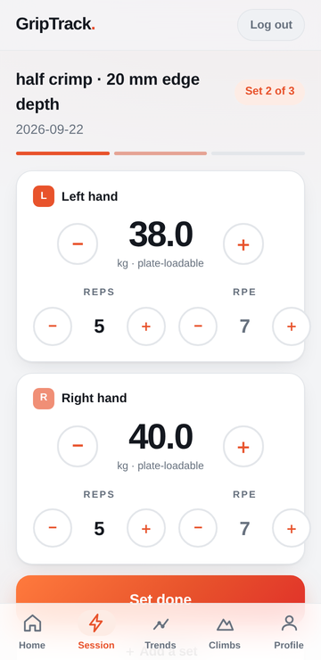
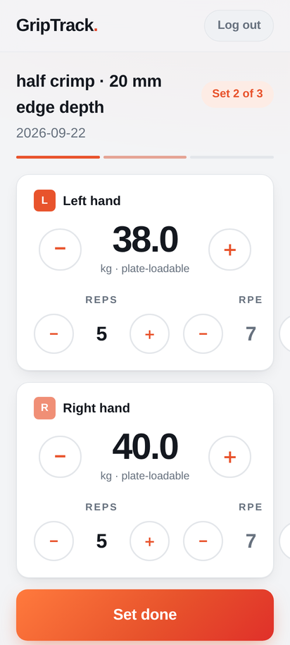
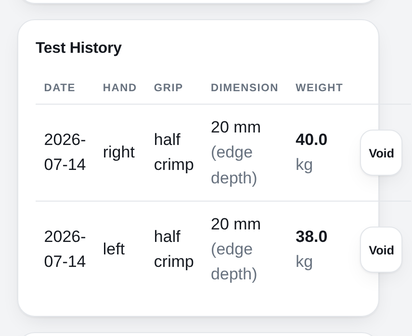
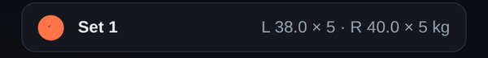
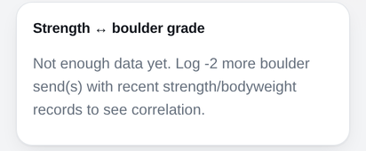
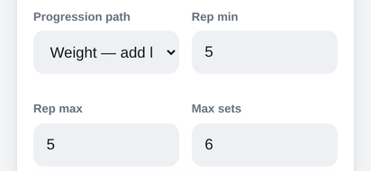
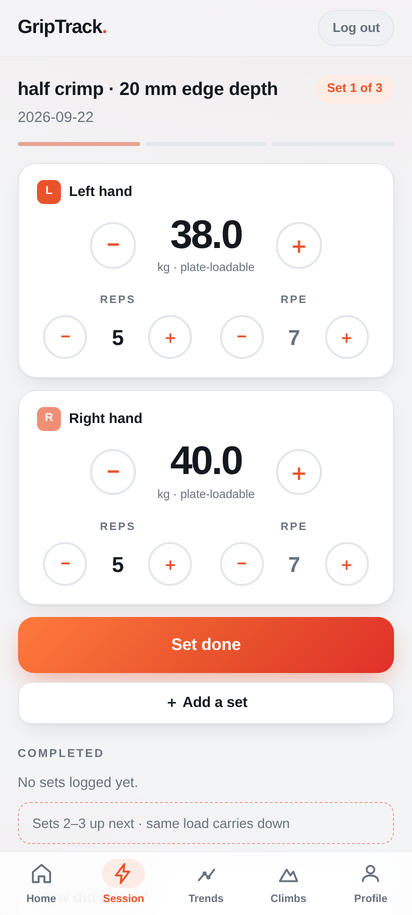
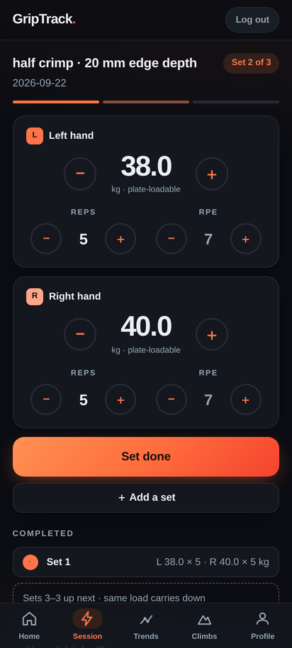
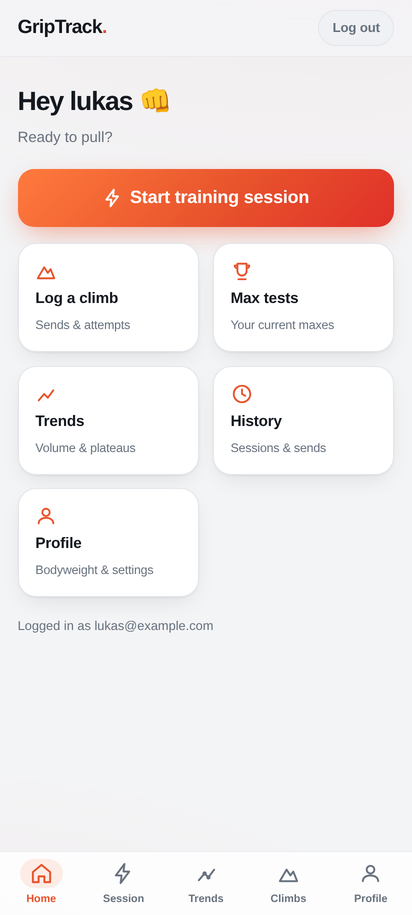
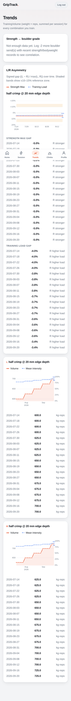

# UI review: GripTrack as an Android app (2026-09-22)

**Scope:** every screen of the web UI (`backend/templates/`, `backend/static/app.css`)
and the Android shell (`android/app/src/main/`). The review asks what changes now
that GripTrack runs as an on-device app in a WebView on one phone, instead of as a
website opened in a browser.

**Method:** I booted the real app (`tests/e2e/conftest.py`'s `live_server`) and
seeded it with ~10 weeks of data: 18 sessions, two max tests, 11 climbs and a
bodyweight entry. I then drove it with Playwright using a Pixel-7-class Android
WebView user agent, touch and `isMobile`, in light and dark mode, at 412 px and
360 px wide, and at 130% font scale. Screenshots are in
`docs/screenshots/ui-review-2026-09/`. Android-shell findings come from reading
the source. They were **not** checked on hardware. The last device smoke test
ran on a Galaxy S22 Ultra with Android 16 (`docs/android-smoke-checklist-2026-08-18.md`).
Findings marked *verify on device* need a look on that phone.

---

## Summary

The Focus session screens are the strongest part of the app. They have large
tabular numerals, 44 px+ targets, one clear primary action, and a dark mode that
looks deliberate rather than inverted. The rest of the app still looks and
behaves like a **website that was put in a frame**:

- It has a login screen and a "Log out" button on every page, and the login expires every 14 days.
- It has admin/invite concepts and a Home screen that duplicates the tab bar.
- It shows raw ISO dates and raw enum values (`left`, `half crimp`, `redpoint`).
- The Android shell doesn't yet handle the things an app gets judged on: system bar insets on Android 15+, the keyboard, Back, dark-mode or config changes, rest-timer alerts while the screen is off, and resuming mid-session after the OS kills the app.

There are also **seven small, verified rendering and copy bugs** (§1). Most are
one-line fixes.

Priority key: **P1** = hurts the core between-hangs flow or is plainly broken ·
**P2** = noticeable friction or looks unfinished · **P3** = polish.

---

## 1. Verified bugs (seen in screenshots)

### 1.1 P1: Work-set cards overflow at 360 px and at larger font sizes

At 360 CSS px (a very common Android width) the RPE **＋** button sticks out of
the hand card's right edge. At 130% font scale it is cut off even at 412 px.
This matters more in the app than it did in a browser: Android WebView's
`textZoom` follows the **system font size** by default, so anyone who has raised
the phone's font size gets the clipped layout on the most-used screen. The cause
is `.reps-rpe-grid` (`app.css:735`): two `1fr` columns, each holding a
fixed-size `−  value  ＋` row (2 × 2.75 rem buttons + `.75rem` gaps + a
`min-width: 2.3rem` value) with no way to shrink.
**Fix:** use `grid-template-columns: repeat(2, minmax(0, 1fr))`, make the
mini-stepper gap and button size `clamp()`-based, or stack Reps above RPE below
~380 px. Don't pin `textZoom = 100` in the shell to hide this; that would break
accessibility.

### 1.2 P1: "Set done" is below the fold on a 360×740 screen
Same screenshot. On a smaller phone the header, the two hand cards and the fixed
tab bar push the one button you press after every hang under the tab bar. You
have to scroll to log a set, and the scroll position changes after each commit.
See §3.1 for the fix (a sticky action bar and a focus mode with no tab bar).

### 1.3 P2: The Max tests page scrolls sideways

The Test History `<table>` (`max_tests.html:32`) with its Void button column is
wider than the viewport. The full-page render is 428 px wide on a 412 px screen,
so the **whole page** pans horizontally. In an app a sideways-panning page reads
as broken. **Fix:** render history as a card list (date, hand and weight on one
line, grip and dimension below, Void as an overflow action), or wrap the table in
the existing `.table-scroll`.

### 1.4 P2: The completed-set checkmark is ~3 px wide

`.completed-check svg { width: 62%; height: 62%; }` (`app.css:976`) sits inside a
`display: grid; place-content: center` parent. The grid track sizes to its
content, so the percentage resolves against almost nothing and the tick collapses
to a speck in the orange dot. **Fix:** give it a fixed size
(`width: .8rem; height: .8rem`) or drop `place-content` and use
`place-items: center`.

### 1.5 P2: "Log -2 more boulder send(s)"

`dashboard.html:29` renders `{{ 8 - correlation.n }}` whenever the correlation is
missing. With 10 sends the correlation can still be undefined (Spearman needs
variance, and a flat `CurrentMax` gives every send the same %BW rank), so the
message asks for **−2** more sends. **Fix:** tell the two cases apart. For
`n < 8`, say "Log N more…". For `n ≥ 8` with no correlation, say "Your strength
hasn't changed across these sends yet, so there's nothing to correlate. Log a
new max test." Also fix the "send(s)" pluralisation.

### 1.6 P3: "Sets 3–3 up next"
`worksets.html:146` and the JS twin at `:888` build "Sets {n+1}–{total}". When
exactly one set is left this reads "Sets 3–3". **Fix:** use "Set 3 up next" when
`n + 1 == total`, in both places.

### 1.7 P3: The progression-path select is truncated

Profile → Default progression path puts a select with long option labels
("Weight — add loadable increment (default)") into half of a `.form-row`, so it
shows as "Weight — add l". **Fix:** give the select the full row, or use short
labels (Weight / Set / Double) with the explanation in helper text.

---

## 2. Android shell: what makes it feel like an app

### 2.1 P1: Edge-to-edge and insets on Android 15+ (*verify on device*)
`targetSdk = 35` on an Android 16 phone means edge-to-edge is **enforced**:
- `android:statusBarColor` (`themes.xml:6`) is ignored.
- The `FrameLayout` / `WebView` draws under the status bar and the gesture bar.
- `adjustResize` no longer resizes the window for the keyboard.

Nothing in `MainActivity` handles `WindowInsets`. The CSS does use
`env(safe-area-inset-*)`, but it only helps if the installed WebView reports
those values for an edge-to-edge app. Expected symptoms: the "GripTrack." header
sits under the clock, the tab bar sits under the gesture pill, and the keyboard
covers the lower inputs on Climbs, Profile and Max tests.
**Fix (native, robust):** use `ViewCompat.setOnApplyWindowInsetsListener(webView)`
to apply `systemBars() or ime()` insets as padding. Alternatively, confirm that
the WebView version reports `safe-area-inset-*` and add IME handling. Use
`WindowInsetsControllerCompat.isAppearanceLightStatusBars` to set status-bar icon
contrast for light and dark mode.

### 2.2 P1: The rest timer stalls in the background and ends silently
`worksets.html:299` counts down with `setInterval(…, 1000)`, decrementing a
counter. Both WebView and Android throttle or freeze timers when the screen goes
off or you switch to your music app, and a rest is exactly when that happens. The
countdown then drifts or pauses. When it does reach 0 it just hides. There is no
vibration, sound or notification, so the timer can't tell you to hang again
unless you're watching the screen.
- Store `restEndsAt = Date.now() + seconds*1000` and render `restEndsAt - now`
  on each tick and on `visibilitychange`. Time stays right after background.
- End-of-rest alert: in an app this is the headline feature. Add a small
  `@JavascriptInterface` (`GripTrackNative.scheduleRestAlarm(ms)` /
  `cancelRestAlarm()`) backed by a notification or `AlarmManager` plus a
  vibration. `navigator.vibrate` isn't an option without the `VIBRATE`
  permission, and the manifest doesn't request it.
- Keep-awake: `navigator.wakeLock` support in Android WebView is unreliable
  (*verify on device*). A native `FLAG_KEEP_SCREEN_ON`, toggled through the same
  bridge while the Focus screen is open, always works.

This overlaps with Wave 4's "real rest timer". The native bridge is the
app-specific part that the Wave 4 grill should now plan for.

### 2.3 P1: Losing your place mid-session
- **Config changes recreate the Activity.** `configChanges`
  (`AndroidManifest.xml:19`) doesn't list `uiMode`, `fontScale` or `density`.
  Switching dark mode (including a scheduled sunset switch), changing font size
  or entering split-screen recreates `MainActivity`. `hasLoadedInitialUrl`
  resets, `onServerReady` loads the **root URL**, and you're back on Home in the
  middle of a set. Any rest countdown and uncommitted stepper values are lost.
- **Process death.** If Android kills the app during a long rest (camera, maps,
  low memory), the next launch goes through the splash to Home.

**Fix:** save the current URL in `onSaveInstanceState` and in `SharedPreferences`
on every `onPageFinished`, and on start restore the last URL if it is a
`/session/…` page. Also add `uiMode` to `configChanges`, or call
`webView.saveState`/`restoreState`.

### 2.4 P2: Back button follows web history, not app navigation
`MainActivity.kt:145` sends Back to `webView.goBack()` whenever it can. Every tab
tap adds a history entry, so Back steps through every tab you visited. After
login, Back can land on the login page again (*verify*). The Android convention
is: Back from a non-Home tab goes to Home, Back from Home exits, and Back inside
a flow (warmup → work sets) steps back through the flow.
**Fix:** decide in the shell. Tab roots go to `/` then `finish()`. Or have the
server mark tab-root pages (`<meta name="gt-root">`) so the shell can tell them
apart.

### 2.5 P2: Two splash screens
Android 12+ always shows the system splash (icon on the theme background). The
custom `splashContainer` ("Starting GripTrack…" with a spinner) then follows, so
you see two different launch screens. **Fix:** use `androidx.core:core-splashscreen`
with `setKeepOnScreenCondition { ServerManager.state != RUNNING }`. That leaves a
single branded launch, with the custom view kept only for the error or retry
state.

### 2.6 P2: Web touch behaviours that show through
- No `-webkit-tap-highlight-color: transparent`, so the WebView flashes a grey or
  blue box on every tap of a button, link or `.completed-row`.
- No `touch-action: manipulation` on the stepper buttons. Long-pressing a stepper
  can start a text selection or context menu (only `.segmented-label` sets
  `user-select: none`). A **press-and-hold to repeat** stepper is the native
  affordance you'd expect here, and it's far better than tapping ＋ eight times.
- `button:hover { filter: brightness(1.05) }` (`app.css:380`) sticks after a tap
  on touch screens. Wrap hover rules in `@media (hover: hover)`.
- Every page transition is a full document load with a `page-in` animation, and
  tab switches also reset scroll. `hx-boost` on the tab bar and in-app links
  would make navigation feel instant with no build step, since htmx is already
  loaded.

### 2.7 P3: Status bar and theme colour
The status bar is hard-wired to brand orange (`themes.xml:6`), which clashes with
dark mode and is ignored on Android 15+ anyway (§2.1). The
`<meta name="theme-color">` and `apple-*` tags in `base.html` do nothing in the
WebView. Draw the header behind a transparent status bar using `--bg`, and drop
the Apple and manifest leftovers in the WebView build.

### 2.8 P3: The error state shows a raw stack trace
`onServerError` puts the full `stackTraceToString()` on screen. That's fine for a
personal build, but a one-line message with a "Copy details" button reads better
and still gives you the trace.

---

## 3. The core flow: warmup and work sets

### 3.1 P1: Give the session its own full-screen mode
During a session the Focus screen should own the whole screen:
- **Hide the tab bar** on `/session/warmup` and `/session/worksets`. It takes
  64 px, sits over "How did it feel?", and makes it easy to leave mid-set by
  accident. Replace it with a compact top bar: ✕ / back on the left, the exercise
  title and "Set 2 of 3" on the right.
- **Pin a sticky action bar** at the bottom holding *Set done*, which becomes the
  rest countdown after a set. The primary action then stays in the same place
  under your thumb on every screen size (fixes §1.2).
- **Drop the "GripTrack. / Log out" header** in this mode. On a 740 px screen it
  costs ~60 px, and a Log out button next to your active set is a mis-tap risk.
- Move "＋ Add a set", "− Remove empty set", "← Back to warmup", "Switch hand" and
  "Done — back home" into a less prominent overflow (a ⋯ menu or the bottom of
  the Completed list). Right now three full-width secondary buttons compete with
  *Set done*.

### 3.2 P2: Warmup ladder
- The checkboxes are empty rounded squares with no label or icon until ticked.
  Make the **whole L/R tile** the tap target, show a ✓ ghost in the unticked
  state, and dim the weight once it's ticked. The code already associates the
  label, so this is mostly styling.
- Scroll to the next unticked rung after each tick, and collapse finished rungs
  so "Continue to work sets" rises into view.
- There's no rest guidance between warmup rungs. A 60 s mini-timer here would
  reuse the same machinery.

### 3.3 P3: Smaller Focus-screen points
- The RPE shows a muted "7" when unset. Show "–" instead: a muted number is easy
  to misread as a logged value.
- The weight caption "kg · plate-loadable" repeats in both cards. Show it once,
  or replace it with something useful: the **plate breakdown** ("20 + 10 + 5 +
  2.5 + 0.5"). Loading the pin is the next physical task, and the app already
  knows the combination from `backend.plates`.
- Haptic tick on each stepper press and on *Set done* (through the native bridge
  in §2.2).

---

## 4. Leftovers from the server era

Now that the app lives on one phone behind the phone's own screen lock, several
web concepts are friction with no benefit:

| What | Where | Suggestion |
|---|---|---|
| "Log out" on every page | `base.html` header | Move to Profile → Account, or drop it in the WebView build. |
| Login expires every 14 days | `SessionMiddleware` default `max_age` | In the WebView build, set a long `max_age` or auto-sign-in the single local user. Being asked for a password at the board is the worst moment for it. |
| Invite / register / "(admin)" cards | `profile.html`, `register.html` | Hide the invite and admin wording in the WebView build. A first-run screen ("Name, units, plates") replaces register. |
| "Hey lukas 👊" from the email prefix | `home.html` | Ask for a name at first run and stop showing the email ("Logged in as …"). |
| Offline page, service worker, manifest, Apple meta tags | `base.html`, `routers/pwa.py` | Already skipped for SW and manifest. Also drop the Apple tags in the WebView build. |
| "Download data export (.zip)" | Profile | Say where it went: a toast or snackbar with "Saved to Downloads", or open the Android share sheet for a backup to Drive. |

---

## 5. Information design, screen by screen

### Home (P2)

Four of the five tiles (Log a climb, Trends, History, Profile) duplicate the tab
bar, and the bottom third of the screen is empty. Make Home about today instead:
- **Resume** card if a session exists today (combo, sets done, "Continue").
- Last session summary (date, combo, top set, volume Δ vs. previous).
- Current maxes as compact chips, with a "retest due" hint where relevant
  (Wave 4 nudges would land here).
- Plateau or overtraining flags surfaced from Trends.
Keep "Start training session" as the hero.

### Trends (P2)

With 10 weeks of data the page is **~4000 CSS px** tall. Under every chart is the
full list of data points (Strength max gap, Training load gap and each volume
series, one row per session). These lists are the accessible fallback, but they
don't need to be open by default. Put them inside `
` ("Show data"), or
replace them with a two-line "latest / change" summary. Also:
- The subtitle leaks glossary jargon: "TrainingVolume (weight × reps, summed per
  session)". Write "Volume = weight × reps per session", and use "kg·reps" rather
  than "kg-reps".
- When one combo is being trained, a combo picker (segmented or dropdown) at the
  top would beat stacking every chart.

### Max tests (P2)
Two data tables on a phone (§1.3), with raw values ("left", "half crimp"). Use a
card per combo showing current max L/R, the date, and "Retest" / "Run guided
test" actions. The void action can go inside a history disclosure.

### Climbs (P2)
- Grade is a free-text box, which is why the loud "grade not recognized" warning
  exists. Local gyms use Font, so a **grade picker** (a horizontal chip row
  5 … 8A+ around your recent grades) removes the error class entirely and is
  faster one-handed. Keep free text behind "Other".
- Style is a `<select>` defaulting to *onsight*. Use the existing
  `_hand_segmented.html` segmented control (Flash / Send / Attempt …), defaulting
  to the last one used.
- The "boulder" pill on every row is noise now that logging is boulder-only.

### History (P3)
Sessions show as "▶ 2026-09-20 · 8 work sets" behind native `
`
triangles. Show combo, top set and volume on the row itself ("Sun 20 Sep · half
crimp 20 mm · top 34 kg · 680 kg·reps"). Group by week. Make the row open the
session (warmup and work sets for that date) instead of an inline expander.

### Profile (P2)
- **Eight** full-width gradient primary buttons (Log bodyweight, Save, Save, Save
  session defaults, Save default progression, Restore, Generate invite, Add grip
  type). When everything is primary, nothing is. The session screens already
  autosave, so do the same for name, hand order and the protocol fields: save on
  change and show a small "Saved ✓" confirmation. Keep a primary button only for
  logging bodyweight.
- Order by frequency: Bodyweight → Training defaults → Plates → Data (export or
  restore) → Advanced (progression overrides, grip types).
- "Restore from export" uses a `--` ASCII dash (`profile.html:175`) and a
  destructive-sounding primary button. Style it as a secondary or danger action.

### Plates (P3)
Works well. Count selects could become steppers (the same component as the Focus
screen) for consistency.

---

## 6. Consistency and polish (P3)

- **Dates:** ISO `2026-09-22` in text, but the locale-formatted `09/22/2026` in
  date inputs. Pick a human format ("Tue 22 Sep", "3 days ago") through a single
  Jinja filter.
- **Display names for enums:** `left` → Left, `half crimp` → Half crimp,
  `redpoint` → Redpoint. Do it with one filter or a `display_name` on the lookup,
  not per template.
- **Inline styles** (`style="…"`) are spread across `profile.html`, `home.html`
  and `max_tests.html`. Move them to classes so light, dark and spacing stay
  consistent.
- **Accessibility carry-over** from the roadmap still applies: chart ARIA titles,
  and warnings that don't rely on colour alone (the plateau and overtraining pills
  are colour plus text, which is good). The light-mode right-hand badge fails
  contrast: white "R" on `--accent-right` (≈ `#f08f76`) is about 2.3:1. Use
  dark text on it, or a darker tint.

---

## What's working, and should be kept

- The Focus hand cards: large 2.5 rem tabular numbers, 44 px+ steppers, one
  primary button, and a loadable-ladder weight stepper. This is the right model,
  and the rest of the app should borrow from it.
- The dark mode palette is well tuned (orange shifted lighter, the
  `--accent-contrast` inversion on buttons).
- The progressive-enhancement discipline (real forms, JS upgrades) is what made
  the WebView port painless. Keep it while adding the native bridge: every bridge
  call should be feature-detected (`window.GripTrackNative?.…`) so the browser
  and test paths keep working.
- Loud-but-kind feedback patterns (grade warning, undo snackbar on delete).

---

## Suggested slicing into issues

1. **Rendering bug batch** (§1.1, §1.3–1.7): CSS and template only, with
   Playwright regressions at 360 px and 130% font scale. *ready-for-agent*
2. **Session full-screen mode** (§3.1, fixes §1.2): no tab bar on session pages,
   sticky action bar, trimmed header. *needs a short grill*
3. **Shell: insets, splash and theme** (§2.1, §2.5, §2.7). *ready-for-agent,
   device verification by owner*
4. **Shell: state restoration and Back** (§2.3, §2.4). *ready-for-agent*
5. **Native bridge: rest alarm, haptics and keep-awake** (§2.2, §3.3). Fold into
   the Wave 4 rest-timer grill.
6. **App-mode cleanup** (§4): long-lived local session, hide logout and admin,
   first-run screen. *needs a short grill (security posture of auto sign-in)*
7. **Home and Trends information design** (§5). *needs a grill*
8. **Touch polish** (§2.6, §6): tap highlight, hold-to-repeat steppers,
   `hx-boost`, date and enum filters. *ready-for-agent*
